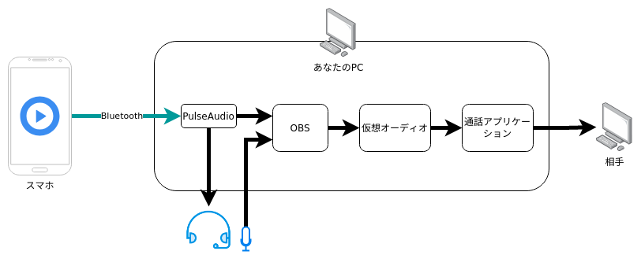
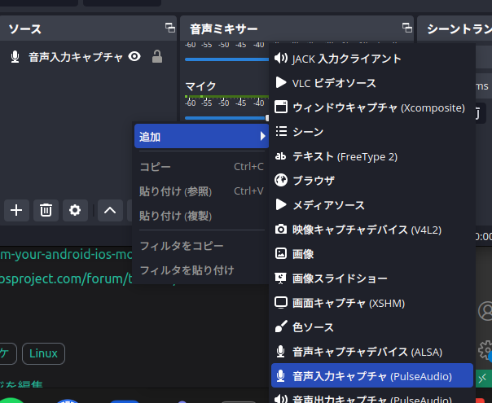
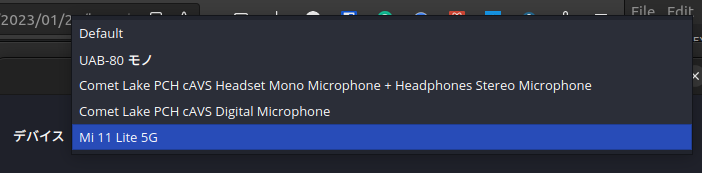
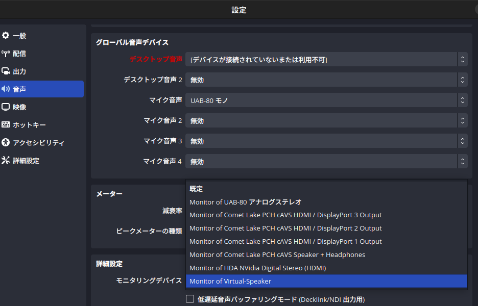
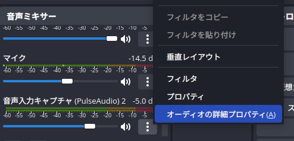
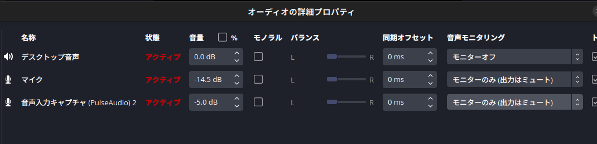
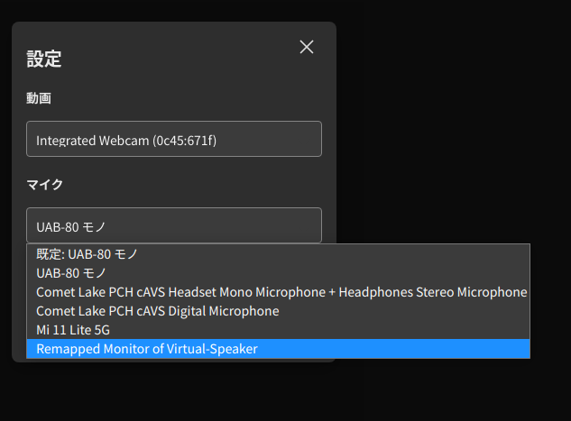
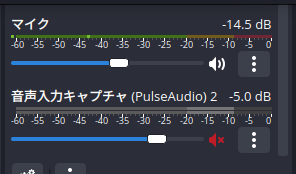
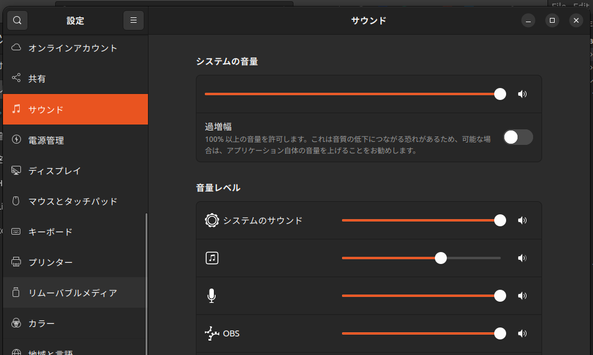

遠くにいる人とカラオケしたいですよね？ということで，リモートカラオケできる環境を作ってみましょう．  
今回は Ubuntu 仕様で書きますが，Bluetooth で音源を持ってくるところと仮想オーディオのドライバを変えれば，同じ構成で Windows でもできると思います．

<!--truncate-->

:::tip Q: いつ Windows 向けの記事が書かれるのですか？

A: 筆者が Windows をメインで使うようになるときです．

:::

:::warning

流す音源は権利的に問題のないものを用いてください．流せる音源や詳しい条件を調べてから実行しましょう．

:::

:::note 謝辞てきなやつ

同研究室の KMGI 先生(同級生)が Bluetooth で PC にストリーミングされており，そこから着想を得ました．ありがとう，KMGI 先生．

:::

## 必要なもの

使うツールとかは後述するので，物理的に必要なものだけ．

- Ubuntu がインストールされた PC
- スマートフォン
- 有線イヤフォン

:::tip なぜ**有線**イヤフォンが必要なのですか？

ハウリング防止です．また，無線でも良いのですが，スマートフォンと PC が Bluetooth を用いて音をストリーミングするため，Bluetooth イヤフォンを用いると干渉して音がプチプチするためです．

:::

## 環境

こんな感じの環境を作ってみます．



:::tip なぜスマートフォンからわざわざストリーミングするのですか？

スマホでしか流せない音源(**あるのか知らんけど**)や，諸々の需要を満たすためです．**自分はあくまでも，手元で流せるのが便利だからやってるだけですよ，ええ**．

:::

## スマートフォンの音源を PC で受け取る[^1]

まず，pulseaudio で使える bluetooth モジュールをインストールします

```sh
sudo apt install pulseaudio-module-bluetooth
```

`/etc/pulse/system.pa`を編集します．

```sh
sudo vim /etc/pulse/system.pa
```

次の記述をファイル末尾に記載します

```
load-module module-bluetooth-policy
load-module module-bluetooth-discover
```

PulseAudio を再起動します．

```
pulseaudio --kill
pulseaudio --start
```

あとは通常のように，スマホを PC を Bluetooth でペア設定すれば，スマートフォンの音が PC から流れるようになります．

## 仮想オーディオ・インターフェイスを作る[^2]

OBS の音源を通話アプリケーションに流すために，仮想オーディオ・インターフェイスを作ります．

```sh
pacmd load-module \
    module-null-sink \
    sink_name=Virtual-Speaker \
    sink_properties=device.description=Virtual-Speaker

pacmd load-module \
    module-remap-source source_name=Remap-Source \
    master=Virtual-Speaker.monitor
```

## OBS を設定する

OBS をインストールし，起動します

<details>
<summary>OBSが起動しないとき</summary>

ターミナルから OBS を起動してみてください(`obs`)．このとき，

```sh
...
The Wayland connection experienced a fatal error: プロトコルエラー
```

と出る時は，Wayland を用いていることによるエラーが発生しています．Wayland が絡む問題を解決しようとするのはわりと大変であるため，代わりに xcb を使います．

```sh
QT_QPA_PLATFORM=xcb obs
```

</details>

### スマートフォンを追加

音声入力キャプチャを追加．



デバイスが表示されていると思いますので選択．



:::info

スマートフォンから数秒音をならさないでいると，項目から消えてしまう/載らないみたいです．追加する時は適当な音源を流しながら，消えてしまった場合は再度再生しながら OBS を再起動してみてください(Bluetooth の再接続はおそらくいらない)．

:::

### モニタリング設定(通話アプリ出力用)

設定から，モニタリング出力先を仮想オーディオ・インターフェイスにします．


オーディオの詳細設定を開いて，  


マイクと電話音源の音声モニタリングを[モニターのみ(出力はミュート)]に設定します．



## 通話アプリケーション側の操作

Remapped Monitor of Virtual-Speaker と書いてるマイクを選択します．うまく行っていれば，OBS の音源(マイク+音源)が垂れ流れてくるはずです．  
Signal の場合はこんな感じ．


## いざカラオケ

歌いましょう．

### 相手に対して音源をコントロール

相手に対して音源をコントロール/ミュートするときは，OBS から行います．


### 自分に対して音源をコントロール

相手に対して音源をコントロール/ミュートするときは，OS の設定から行います．  
自分の場合，[システムのサウンド]の下にある無名の ♪ 音符マークがそれでした．


## 評判

通話アプリにもよると思いますが，かなり音源がクリアに聞こえたそうです．よかったよかった．

[^1]: https://www.cyberciti.biz/mobile-devices/linux-set-up-bluetooth-speaker-to-stream-audio-from-your-android-ios-mobile-phone/
[^2]: https://obsproject.com/forum/threads/obs-audio-zoom-on-ubuntu.131957/
