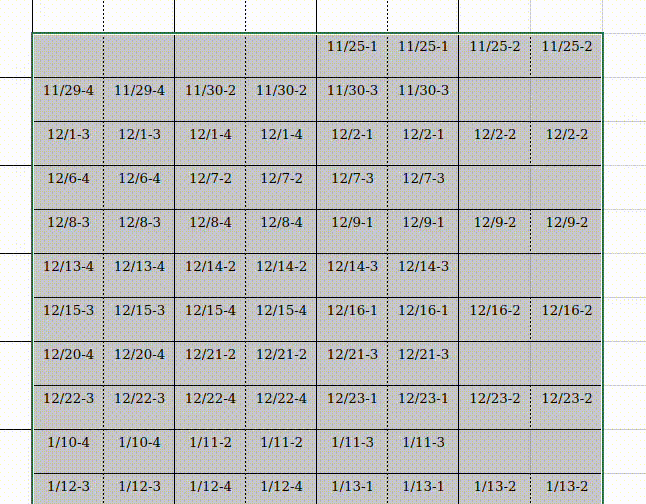
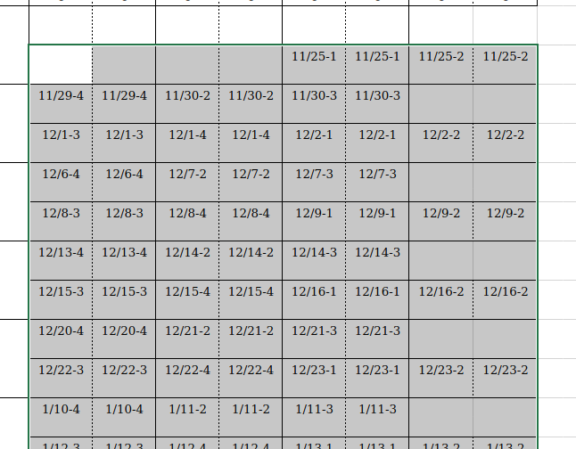

週報面倒くさいですよね．一瞬で丸をつけましょう．



<!--truncate-->

:::caution

身内ネタすぎる

:::

## 丸をつけたい箇所をコピー
まず，丸をつけたい箇所をすべて囲い，コピーしましょう．


## 適当なテキストエディタに貼り付ける
テキストとして貼り付けて保存してください．

こんな感じになるはずです．
```txt title=tmp.txt
				"11/25-1
"	"11/25-1
"	"11/25-2
"	"11/25-2
"
"11/29-4
"	"11/29-4
"	"11/30-2
"	"11/30-2
"	"11/30-3
...
```

<details>
<summary>全体</summary>

```txt title=tmp.txt
				"11/25-1
"	"11/25-1
"	"11/25-2
"	"11/25-2
"
"11/29-4
"	"11/29-4
"	"11/30-2
"	"11/30-2
"	"11/30-3
"	"11/30-3
"		
"12/1-3
"	"12/1-3
"	"12/1-4
"	"12/1-4
"	"12/2-1
"	"12/2-1
"	"12/2-2
"	"12/2-2
"
"12/6-4
"	"12/6-4
"	"12/7-2
"	"12/7-2
"	"12/7-3
"	"12/7-3
"		
"12/8-3
"	"12/8-3
"	"12/8-4
"	"12/8-4
"	"12/9-1
"	"12/9-1
"	"12/9-2
"	"12/9-2
"
"12/13-4
"	"12/13-4
"	"12/14-2
"	"12/14-2
"	"12/14-3
"	"12/14-3
"		
"12/15-3
"	"12/15-3
"	"12/15-4
"	"12/15-4
"	"12/16-1
"	"12/16-1
"	"12/16-2
"	"12/16-2
"
"12/20-4
"	"12/20-4
"	"12/21-2
"	"12/21-2
"	"12/21-3
"	"12/21-3
"		
"12/22-3
"	"12/22-3
"	"12/22-4
"	"12/22-4
"	"12/23-1
"	"12/23-1
"	"12/23-2
"	"12/23-2
"
"1/10-4
"	"1/10-4
"	"1/11-2
"	"1/11-2
"	"1/11-3
"	"1/11-3
"		
"1/12-3
"	"1/12-3
"	"1/12-4
"	"1/12-4
"	"1/13-1
"	"1/13-1
"	"1/13-2
"	"1/13-2
"
"1/17-4
"	"1/17-4
"	"1/18-2
"	"1/18-2
"	"1/18-3
"	"1/18-3
"		
"1/19-3
"	"1/19-3
"	"1/19-4
"	"1/19-4
"	"1/20-1
"	"1/20-1
"	"1/20-2
"	"1/20-2
"
"1/24-4
"	"1/24-4
"	"1/25-2
"	"1/25-2
"	"1/25-3
"	"1/25-3
"		
"1/26-3
"	"1/26-3
"	"1/26-4
"	"1/26-4
"	"1/27-1
"	"1/27-1
"	"1/27-2
"	"1/27-2
"
							
				"2/3-1
"	"2/3-1
"	"2/3-2
"	"2/3-2
"
"2/7-4
"	"2/7-4
"	"2/8-2
"	"2/8-2
"	"2/8-3
"	"2/8-3
"		
"2/9-3
"	"2/9-3
"	"2/9-4
"	"2/9-4
"				

```

</details>

## 行頭に○をつける

```
cat tmp.txt | awk '{print "○" $0}' > tmp2.txt
```

```txt title=tmp2.txt
○				"11/25-1
○"	"11/25-1
○"	"11/25-2
○"	"11/25-2
○"
○"11/29-4
○"	"11/29-4
○"	"11/30-2
○"	"11/30-2
○"	"11/30-3
...
```

<details>
<summary>全体</summary>

```txt title=tmp.txt
○				"11/25-1
○"	"11/25-1
○"	"11/25-2
○"	"11/25-2
○"
○"11/29-4
○"	"11/29-4
○"	"11/30-2
○"	"11/30-2
○"	"11/30-3
○"	"11/30-3
○"		
○"12/1-3
○"	"12/1-3
○"	"12/1-4
○"	"12/1-4
○"	"12/2-1
○"	"12/2-1
○"	"12/2-2
○"	"12/2-2
○"
○"12/6-4
○"	"12/6-4
○"	"12/7-2
○"	"12/7-2
○"	"12/7-3
○"	"12/7-3
○"		
○"12/8-3
○"	"12/8-3
○"	"12/8-4
○"	"12/8-4
○"	"12/9-1
○"	"12/9-1
○"	"12/9-2
○"	"12/9-2
○"
○"12/13-4
○"	"12/13-4
○"	"12/14-2
○"	"12/14-2
○"	"12/14-3
○"	"12/14-3
○"		
○"12/15-3
○"	"12/15-3
○"	"12/15-4
○"	"12/15-4
○"	"12/16-1
○"	"12/16-1
○"	"12/16-2
○"	"12/16-2
○"
○"12/20-4
○"	"12/20-4
○"	"12/21-2
○"	"12/21-2
○"	"12/21-3
○"	"12/21-3
○"		
○"12/22-3
○"	"12/22-3
○"	"12/22-4
○"	"12/22-4
○"	"12/23-1
○"	"12/23-1
○"	"12/23-2
○"	"12/23-2
○"
○"1/10-4
○"	"1/10-4
○"	"1/11-2
○"	"1/11-2
○"	"1/11-3
○"	"1/11-3
○"		
○"1/12-3
○"	"1/12-3
○"	"1/12-4
○"	"1/12-4
○"	"1/13-1
○"	"1/13-1
○"	"1/13-2
○"	"1/13-2
○"
○"1/17-4
○"	"1/17-4
○"	"1/18-2
○"	"1/18-2
○"	"1/18-3
○"	"1/18-3
○"		
○"1/19-3
○"	"1/19-3
○"	"1/19-4
○"	"1/19-4
○"	"1/20-1
○"	"1/20-1
○"	"1/20-2
○"	"1/20-2
○"
○"1/24-4
○"	"1/24-4
○"	"1/25-2
○"	"1/25-2
○"	"1/25-3
○"	"1/25-3
○"		
○"1/26-3
○"	"1/26-3
○"	"1/26-4
○"	"1/26-4
○"	"1/27-1
○"	"1/27-1
○"	"1/27-2
○"	"1/27-2
○"
○							
○				"2/3-1
○"	"2/3-1
○"	"2/3-2
○"	"2/3-2
○"
○"2/7-4
○"	"2/7-4
○"	"2/8-2
○"	"2/8-2
○"	"2/8-3
○"	"2/8-3
○"		
○"2/9-3
○"	"2/9-3
○"	"2/9-4
○"	"2/9-4
○"						
```

</details>

## いらんところの○けずる
このままだと不要なところの○のせいでフォーマットが崩れてしまいます．いらないところを削りましょう．フォーマットとして，

```
"n/n-2
○"
```

上記に該当する○以外すべて不要ですので削ります．

:::note Q.ワンライナーでできるようにすればええやん
ワンライナーを考える時間より，すぐにわかる方法を優先しています~~(正規表現を考えるのが面倒くさい))~~
:::

```diff {1-2,7-8} title=tmp2.txt
- ○				"11/25-1
+ 				"11/25-1
○"	"11/25-1
○"	"11/25-2
○"	"11/25-2
○"
- ○"11/29-4
+ "11/29-4
○"	"11/29-4
○"	"11/30-2
○"	"11/30-2
○"	"11/30-3
...
```

<details>
<summary>全体</summary>

```txt title=tmp.txt
				"11/25-1
○"	"11/25-1
○"	"11/25-2
○"	"11/25-2
○"
"11/29-4
○"	"11/29-4
○"	"11/30-2
○"	"11/30-2
○"	"11/30-3
○"	"11/30-3
○"		
"12/1-3
○"	"12/1-3
○"	"12/1-4
○"	"12/1-4
○"	"12/2-1
○"	"12/2-1
○"	"12/2-2
○"	"12/2-2
○"
"12/6-4
○"	"12/6-4
○"	"12/7-2
○"	"12/7-2
○"	"12/7-3
○"	"12/7-3
○"		
"12/8-3
○"	"12/8-3
○"	"12/8-4
○"	"12/8-4
○"	"12/9-1
○"	"12/9-1
○"	"12/9-2
○"	"12/9-2
○"
"12/13-4
○"	"12/13-4
○"	"12/14-2
○"	"12/14-2
○"	"12/14-3
○"	"12/14-3
○"		
"12/15-3
○"	"12/15-3
○"	"12/15-4
○"	"12/15-4
○"	"12/16-1
○"	"12/16-1
○"	"12/16-2
○"	"12/16-2
○"
"12/20-4
○"	"12/20-4
○"	"12/21-2
○"	"12/21-2
○"	"12/21-3
○"	"12/21-3
○"		
"12/22-3
○"	"12/22-3
○"	"12/22-4
○"	"12/22-4
○"	"12/23-1
○"	"12/23-1
○"	"12/23-2
○"	"12/23-2
○"
"1/10-4
○"	"1/10-4
○"	"1/11-2
○"	"1/11-2
○"	"1/11-3
○"	"1/11-3
○"		
"1/12-3
○"	"1/12-3
○"	"1/12-4
○"	"1/12-4
○"	"1/13-1
○"	"1/13-1
○"	"1/13-2
○"	"1/13-2
○"
"1/17-4
○"	"1/17-4
○"	"1/18-2
○"	"1/18-2
○"	"1/18-3
○"	"1/18-3
○"		
"1/19-3
○"	"1/19-3
○"	"1/19-4
○"	"1/19-4
○"	"1/20-1
○"	"1/20-1
○"	"1/20-2
○"	"1/20-2
○"
"1/24-4
○"	"1/24-4
○"	"1/25-2
○"	"1/25-2
○"	"1/25-3
○"	"1/25-3
○"		
"1/26-3
○"	"1/26-3
○"	"1/26-4
○"	"1/26-4
○"	"1/27-1
○"	"1/27-1
○"	"1/27-2
○"	"1/27-2
○"
							
				"2/3-1
○"	"2/3-1
○"	"2/3-2
○"	"2/3-2
○"
"2/7-4
○"	"2/7-4
○"	"2/8-2
○"	"2/8-2
○"	"2/8-3
○"	"2/8-3
○"		
"2/9-3
○"	"2/9-3
○"	"2/9-4
○"	"2/9-4
○"								
```

</details>

## 貼り付け
上記を貼り付けます．終わり．

