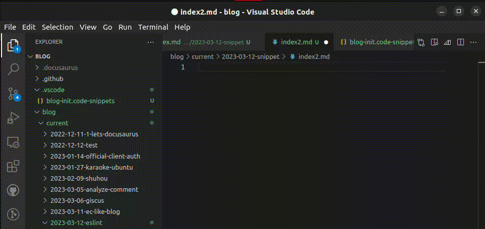
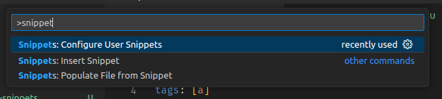
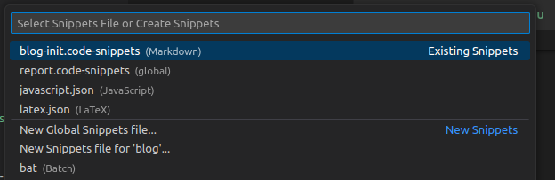

皆様こんにちは．コーディング，していますか？  
コーディングをする人も，レポートを作る皆様も，最初の書き出しはある程度同じ，つまりテンプレート化できるようなものばっかりではないですか？



<!--truncate-->

実際問題，当ブログもDocusaurusを用いているため，書き方にはある程度決まりがあります．そのため，毎度書くお決まり文句みたいなものが実際あります．

```markdown
---
title: いい感じのタイトル...
authors: [bonychops]
tags: []
---

目次にも表示される文章...

<!--truncate-->

本文...

```

こういうのって，多分以前に作ったものをコピーしてきたり，テンプレを作っておいてコピーしてきたり...などで解決していますよね？それ，Snippetで解決しましょう．

## やる

`Ctrl + Shift + P`(または`F1`)でコマンドパレットを表示，`Snippets: Configure User Snippets`から，





`New Global Snippets file...`ですべてのワークスペース，`New Snippets file for 'ワークスペース名'`でそのワークスペース限定のスニペットが作成されます．今回は後者．

```json title=blog-init.code-snippets
{
	// Place your blog workspace snippets here. Each snippet is defined under a snippet name and has a scope, prefix, body and
	// description. Add comma separated ids of the languages where the snippet is applicable in the scope field. If scope
	// is left empty or omitted, the snippet gets applied to all languages. The prefix is what is
	// used to trigger the snippet and the body will be expanded and inserted. Possible variables are:
	// $1, $2 for tab stops, $0 for the final cursor position, and ${1:label}, ${2:another} for placeholders.
	// Placeholders with the same ids are connected.
	// Example:
	// "Print to console": {
	// 	"scope": "javascript,typescript",
	// 	"prefix": "log",
	// 	"body": [
	// 		"console.log('$1');",
	// 		"$2"
	// 	],
	// 	"description": "Log output to console"
	// }
}
```

例が書いてあるので，それに従って書いてみます．

```json title=blog-init.code-snippets
{
	"blog-init": {
		"scope": "markdown", //対象ファイル
		"prefix": "blog-init", //呼び出すときの名前
		"body": [ //$nを定義すると，Tabでジャンプできます(ブログ冒頭のGIF参照)
			"---",
			"title: $1",
			"authors: [bonychops]",
			"tags: [$2]",
			"---",
			"$3",
			"",
			"<!--truncate-->"
		]
	}
}
```

あとはprefixを入力して(候補が出なければ`Ctrl + Space`)，タブを何回か打つと，`$n`のところにジャンプします．


## おまけ
`"body"`の部分を作るのがだるい？しょうがないですね，以下のワンライナーを使ってください．  
`<ここ>`を編集して，変換したい文章を入れてください．

```shell
node -e 'console.log(JSON.stringify(`<ここ>`.split("\n"), null, 2))'
```

```txt title=実行結果
❯ node -e 'console.log(JSON.stringify(`---                        
title: いい感じのタイトル...
authors: [bonychops]
tags: []
---

目次にも表示される文章...

<!--truncate-->

本文...
`.split("\n"), null, 2))'
[
  "---",
  "title: いい感じのタイトル...",
  "authors: [bonychops]",
  "tags: []",
  "---",
  "",
  "目次にも表示される文章...",
  "",
  "<!--truncate-->",
  "",
  "本文...",
  ""
]
```