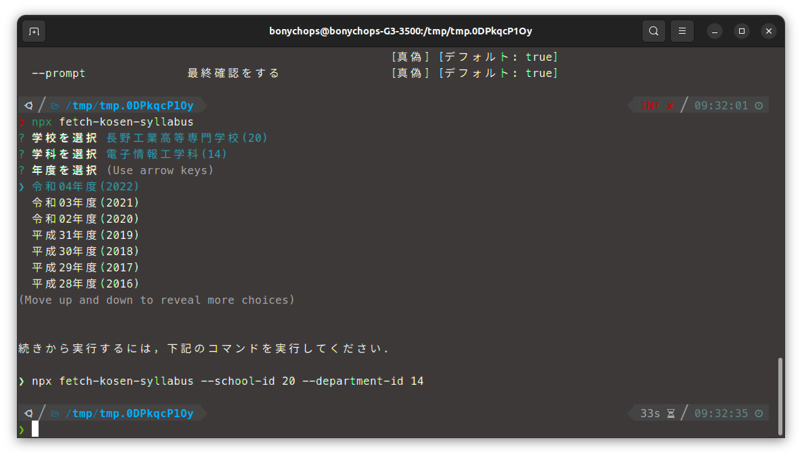
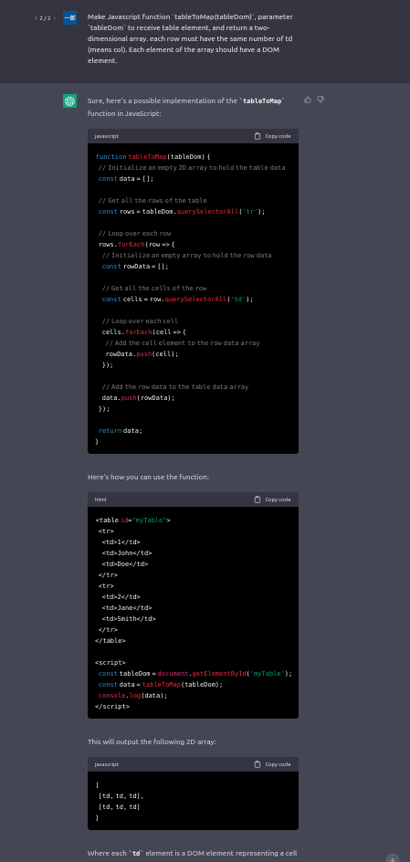

import Tabs from '@theme/Tabs';
import TabItem from '@theme/TabItem';
import { TwitterTweetEmbed } from 'react-twitter-embed';

<TwitterTweetEmbed
    tweetId={'1641297775412518914'}
/>

{/* <!--truncate--> */}

## 使う
:::info
使うには，Node.jsとnpmが動作する環境を用意してください．

<Tabs>
  <TabItem value="windows" label="Windows" default>
    <a href="https://nodejs.org/ja"> nodejs.org
     </a>からダウンロード・インストールしてください
  </TabItem>
  <TabItem value="mac" label="Mac">
    次で検索


    mac nodejs インストール
  </TabItem>
  <TabItem value="linux" label="Linux">
    次で検索


    [distro名] nodejs インストール
  </TabItem>
</Tabs>

:::

ダウンロードしたいディレクトリ(フォルダ)で呼び出します(初回実行時に必要なパッケージetcが自動でダウンロードされます)．

```
npx fetch-kosen-syllabus
```

あとは，対話型に進むので選んでいくだけです．


実行時に引数で指定することもできます


<details>
<summary>引数一覧
</summary>

```
❯ npx fetch-kosen-syllabus --help
\fetch-kosen-syllabus [path]

高専のシラバスPDFを一括ダウンロードする

位置:
  path  ダウンロード先のディレクトリパス
                                    [文字列] [デフォルト: "/tmp/tmp.0DPkqcP1Oy"]

オプション:
  --help                 ヘルプを表示                                     [真偽]
  --version              バージョンを表示                                 [真偽]
  --school-id            学校ID                                         [文字列]
  --department-id        学科ID                                         [文字列]
  --year                 年度                                           [文字列]
  --grades               学年                                             [配列]
  --additional-subjects  追加する科目ID                                   [配列]
  --exclude-subjects     除外する科目ID                                   [配列]
  --marge                ダウンロード完了時にPDFをマージする
                                                       [真偽] [デフォルト: true]
  --prompt               最終確認をする                [真偽] [デフォルト: true]

```

</details>

ダウンロードが完了すると，各PDFファイルとすべてを結合した`marged-syllabus-YYYY-MM-DD-hh-mm-ss.pdf`がディレクトリに作成されます．


## 注意事項

:::caution
すべての高専で検証したわけではないので，もしかしたらうまく行かない学校や学科があるかもしれません
:::

## ~~無駄な~~こだわりポイント

紹介します．

### 中断時に続行するためのコマンドが表示される
これのためにオプション引数を作ったまであります．



### 並列ダウンロード
複数ファイルを並列にダウンロードするので，割と早くダウンロードが終わります(GIF流用)．


## このツールの作り方

まあここからがブログっぽい話になるのですが，このツールの作り方と題して，どんな流れで作ったかを一応紹介しておきます．

<a href="https://github.com/BonyChops/fetch-kosen-syllabus" className="clean-btn button button--primary">GitHub
</a>
<a href="https://www.npmjs.com/package/fetch-kosen-syllabus" className="clean-btn button button--primary" style={{marginLeft: "10px"}}>npm
</a>

### syllabus.kosen-k.go.jpを見に行く
いわゆるスクレイピングをするにあたって，まずはシラバスページを偵察しに行きます．

使えそうなclassとかidとか特徴とかを探ります．識別子っぽいのがないこともあるのでそこら編は破壊的変更がないことを祈ります...


### DOM操作でごりごり頑張る
上記で見つけたclassとかidとかを元にDOM操作をがんばります．DOMの操作は[jsdom](https://www.npmjs.com/package/jsdom)を使いました．


(フォーラム高専ってなんだろう？まあそういう高専もあるかもしれないのでとっておくか)


### 理不尽と戦う

:::caution
ここからは理屈ではなく根性論が含まれます．
:::

#### あまりにも複雑な表

なんだこれ...


当然，すべてHTMLで構成されているので，これをどうにかしないといけません．軽く絶望したので，助手のChatGPTさんに実装方針を相談したりしました．



しかし，あんまりうまくいきませんでした．というのも，`col-span`や`row-span`がふんだんに使われたtableなので，ただ2重`forEach`でゴリゴリやれば良いというものではないです．考慮する事項が若干面倒くさいので競プロやってる気分になりました．

結局，ChatGPTさんに有名ライブラリを紹介していただくことで解決しました．[cheerio-tableparser](https://www.npmjs.com/package/cheerio-tableparser)を採用します[^1]．


ただ，`parsetable()`が返す二次元配列が，一次元目がcol，二次元目がrowで若干扱いづらかったので，転置[^2]させてから扱うことにします．

```javascript title=src/syllabys.js
const cheerioDom = cheerio.load(syllabysTableDom.outerHTML);
cheerioTableparser(cheerioDom);

const syllabysTableTransposed = cheerioDom('table').parsetable(
    true,
    true,
    false
);
const syllabysTable = syllabysTableTransposed[0].map((col, i) =>
    syllabysTableTransposed.map((row) => row[i])
);
```

### tableに隠された巧妙な罠
またtableです．いざパースしようとすると，なぜか各行で列の数が合いません．各セルを確認してみると...


なんか隠れてるセルがある...なんでそういうことするんだ．

狭い画面の時に動的に表示するためのものでしょうか？これのせいを消したら各行の数が合い，table上部の項目名と比較ができるようになりました．

(隠されたセルを表示した図．JSDOMの目にはこう映っていたらしい)


### yearが合ってない
シラバスのデータも手に入れたので，いざ一括ダウンロード！


**どうして...**

<TwitterTweetEmbed
  tweetId={'1641053709273796609'}
/>

どうやら，**開口年度が「令和04年度 (2022年度)」の科目の`year`パラメータは2018だったり2019だったりするようです** *(?????????????)*

かなり気に食いませんが，シラバスのデータ(table)の科目リンクに`year`パラメータが含まれているので，そこから無理やり持ってくることにします．

### npmにpublish
あとは簡単に使っていただけるよう，npxからの実行を想定した形でpublishします．
npxで呼んでもらえる形式で出すときは，`package.json`の`bin`で指定すれば良いみたいです．

```json title=package.json
{
    //...
    "bin": {
        "fetch-kosen-syllabus": "bin/fetch-kosen-syllabus"
    },
    //...
}
```

あとはESLintとかPrettierで体裁を整えてから，`npm publish`．

[^1]: ここではjsdomでもできるっておっしゃってるんですけどね...jsdomでのやり方がよくわからなかったので[cheerio-tableparser](https://www.npmjs.com/package/cheerio-tableparser)にしました(最悪)
[^2]: https://qiita.com/kznrluk/items/790f1b154d1b6d4de398