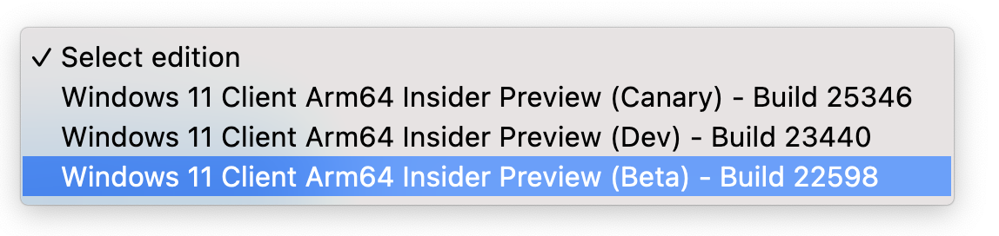
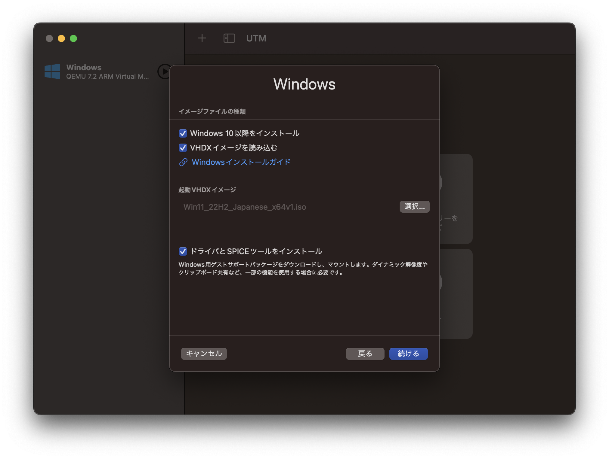
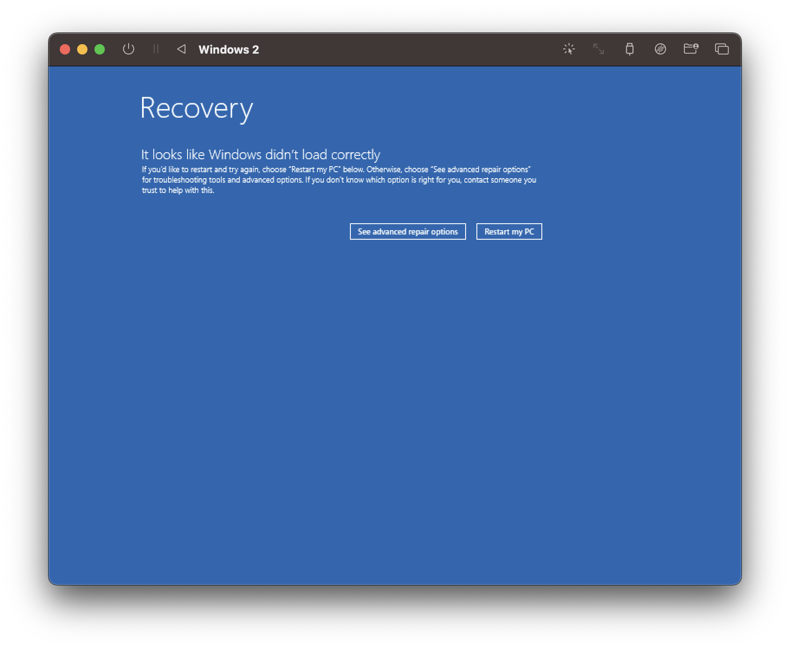
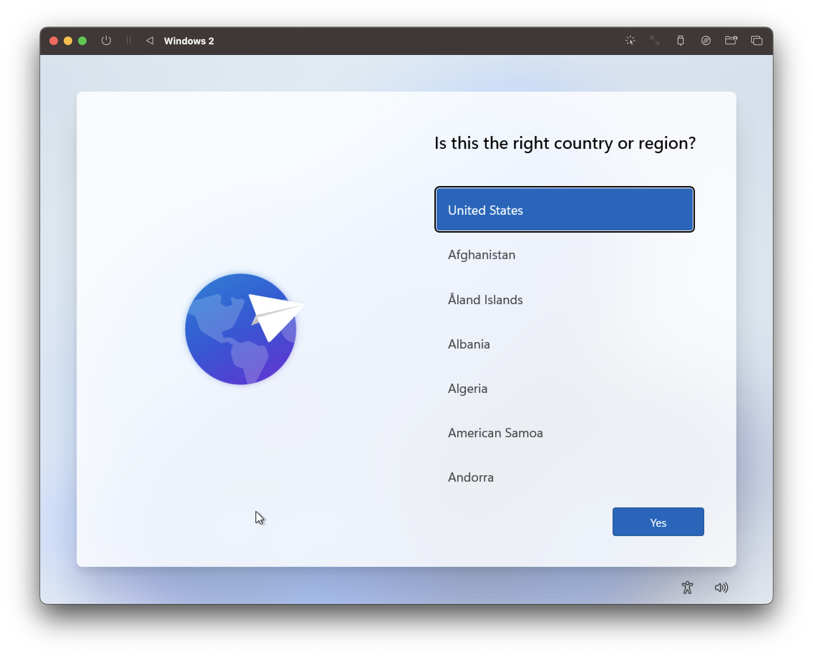
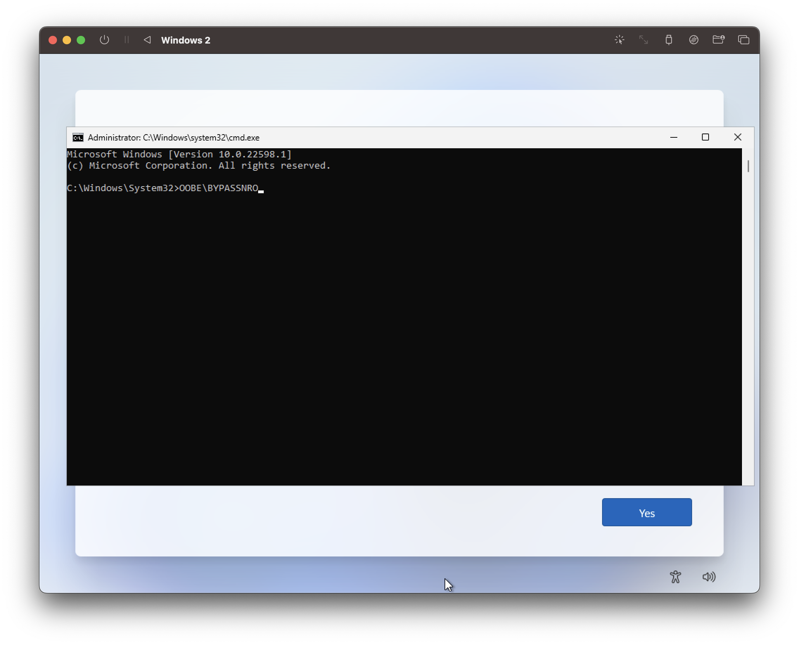
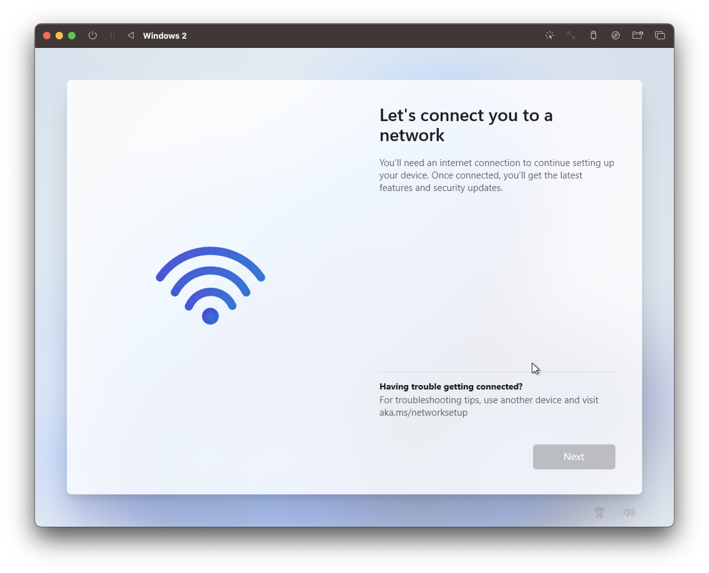

みなさん，Mac 使ってますか？自分は最近買いましたがめちゃくちゃ快適で日々の QoL が格段に上がりました．  
今回は，そんな M1 Mac で Windows を仮想で起動する方法について記載していきたいと思います．もちろん，私は学生ですのでお金のかかる方法では構築しません．すべて無料です．

<!--truncate-->

:::info
別に M1 に限らず，M2 や今後出るかもしれない M3 でも再現できると思います．要は，**Apple Silicon(arm チップ)**向けの記事ってことです
:::

:::caution
ただ，自分は M1 Mac Air しか持ってないので，それ以外での環境で再現することができません．よって，もしかしたら別環境では再現できないかもしれないことを留意してください
:::

:::caution
すべて無料と言いましたが，Windows のライセンスに関してはご自身で用意してください．大学によりますが，Education であれば無料で使えるところもあるので，それを活用しましょう．
:::

:::note
公式では UUP dump と称されているサイトからイメージを落とすことを推奨されていますが，自分はあまり非公式のイメージを使いたくないためこの方法を取っています．公式が案内する方法を使いたい場合は，[Windows 11 | UTM Documentation](https://docs.getutm.app/guides/windows/)をご覧ください．
:::

## Arm 版 Windows を用意する

まず，Arm 版 Windows のイメージを入手します．

:::info
Windows では任意 CPU アーキテクチャ向けのバイナリを Arm で実行するすご機能があります，しかし，Win 10 だと x86 バイナリのみ，Win 11 は x86，x64 両者対応なので，**よくわからなかったら Win 11 にする**ことを**強く**お勧めします．
:::

1. Windows Insider Program に登録する
   Arm 版 Windows は Preview という位置付けなので，Insider Program への登録が必要です．こちらの[The Windows Insider Program](https://www.microsoft.com/ja-jp/windowsinsider/)で申請をします．
   1. こちらの青い[登録]をクリック  
      
   1. Microsoft アカウントでログイン
   1. 必要事項を入力し，登録を完了させる
1. 登録が完了したら，[Download Windows Insider Preview ARM64](https://www.microsoft.com/en-us/software-download/windowsinsiderpreviewARM64)から，Win11 の Arm 版をダウンロードします．
   1. エディションを選びます． 一番安定している Beta を選びます
      
   1. 言語を選びます．英語しかありません；；
   1. ダウンロード．大体 10GB ぐらいあります...

## UTM をダウンロード/インストール

仮想環境として UTM というものを使います．同一 CPU アーキテクチャでも，違うやつでも動かせる優れものです．

1. [mac.getutm.app](https://mac.getutm.app/)にアクセス
1. なぜか App Store だと$9.99 するので，Download をクリックして無償でダウンロードします
1. 恒例のやつをやります  
   
   :::note
   これのためだけにためだけに 242MB 落としました
   :::

## UTM 設定

1. 新規仮想マシンを作成をクリック  
   :::note
   なんかすでに Win が生えていますが気にしないでください
   :::
   
1. 仮想化をクリック  
   
1. **VHDX イメージを読み込む**にチェックを入れて，先ほどダウンロードした arm 版 Windows のイメージを選択  
   :::info
   写真では間違えていますが，`Windows11_InsiderPreview_Client_ARM64_en-us_xxxxx.VHDX`を選んでください
   :::
   
1. メモリはマシンの半分ぐらいのメモリを割り当てましょう(最低でも 4096MB)．  
   
1. 共有ディレクトリは，Win と共有できるフォルダの設定です．Mac から Win に転送したいファイルがあれば，設定すると便利かもしれません．  
   
1. 設定が完了するとこんな感じです  
   
1. ネットワークの設定だけ先に行っておきます．ここをクリックしてください．
   
1. ネットワークの設定を開いて，ネットワークモードを**仮想 VLAN**にしてください  
     
   
1. これで一通りの設定は完了です！

## 解像度を大きくしておく

初期設定だと解像度が小さく，押せない箇所が出てくるので先に広げておきます．

1. ▶️ 再生ボタンを押して Windows を起動します
   :::caution
   **起動したら即座に`esc`を連打します！** 詳しくは次をご覧ください．
   :::
   
1. `Start boot option`が出たら**即座に**`esc`を連打します  
   
1. `Device Manager`を選択
   
1. `OVMF Platform Configuration`を選択
   
1. 解像度を`1024x768`に設定します
   
1. `esc`を押して，`y`を押して保存します
   
1. `esc`を何回か押し，最初の画面に戻ったら`Continue`
   
1. これで解像度が大きめのウィンドウが立ち上がるようになりました
   :::info
   もし，こんな感じの表示が出たら**Restart my PC**をすれば良いですが，これで再起動した後は起動しないかもしれません．そういう時は一度ウィンドウを閉じて，再度起動し直してください  
    
   :::

## Windows セットアップ

1. こんな感じで起動したら，
   
1. `Shift + (fn) + F10`でターミナルを起動します(**_！？！？！？！_**)
   1. Yes
      
   1. ターミナルが開く
      
1. `OOBE\BYPASSNRO`と入力して`Enter`(勝手に再起動します)．
   :::info US 配列
   `\`は`]`を入力するキー(ひらがな: `む`)を押します
   :::
   
   :::info この儀式はなに...？
   これは，のちのネットワークの設定をスキップするための儀式です．この仮想マシンはドライバをインストールしていない状態なので，現状ネットワークに接続できませんが，Win11 のセットアップはネットワークの設定をスキップできない仕様になっています．  
   その上，以下の画像のネットワーク構成画面になると**なぜか**`Shift + F10`が効かなくなり詰むのでここで入力する必要があります．~~_(MS くんさあ...)_~~  
    
   :::
1. 再起動したら，諸々の設定を進めていきます(初歩的なところは飛ばします)
1. ネットワークの設定で，**I don't have internet**を選択
   
1. いろいろ入力します
1. This might take a few minutes. なので待ちましょう．  
   
1. Windows 起動！！
   
1. 左上のディスクアイコンをクリックして，一番下が`spice-guest-tools-x.x.x.iso`になっていることを確認してください(なっていなければ**Windows ゲストツールをインストール...**)．  
     
   
1. `UTM`というディスクがマウントされているので，その中の`spice-guest-tools-x.x.x`を実行
   
1. インストールが完了したら**Reboot now**，もしくは手動で Windows を再起動
1. 再起動したらネットに接続できるようになり，ウィンドウサイズを変えて自由に解像度も変更できます．**完成！！**
   

## 今後やるべき

今後やるべきことを書いておきます

- **ライセンス認証**: 早めにやっておきましょう．~~まあしなくても使えないことはないですが，~~学校で配布されている Win ライセンスなどを活用しましょう．
- **日本語化**: 必要な人はやっておきましょう．ただ，できるのかは定かじゃないです(自分がしようとしたらうまくいかなかった)．

## 注意

:::caution
今回使っているのはあくまでも**Arm 版**Windows であり，x64 は Windows の謎テクノロジーで動くだけなので，ハイパフォーマンスや通常通りの動作をすることが保証されていません(例えば，Visual Studio は x64 マシンにリモート接続することを推奨してきます)．使う時は自己責任でね．
:::
