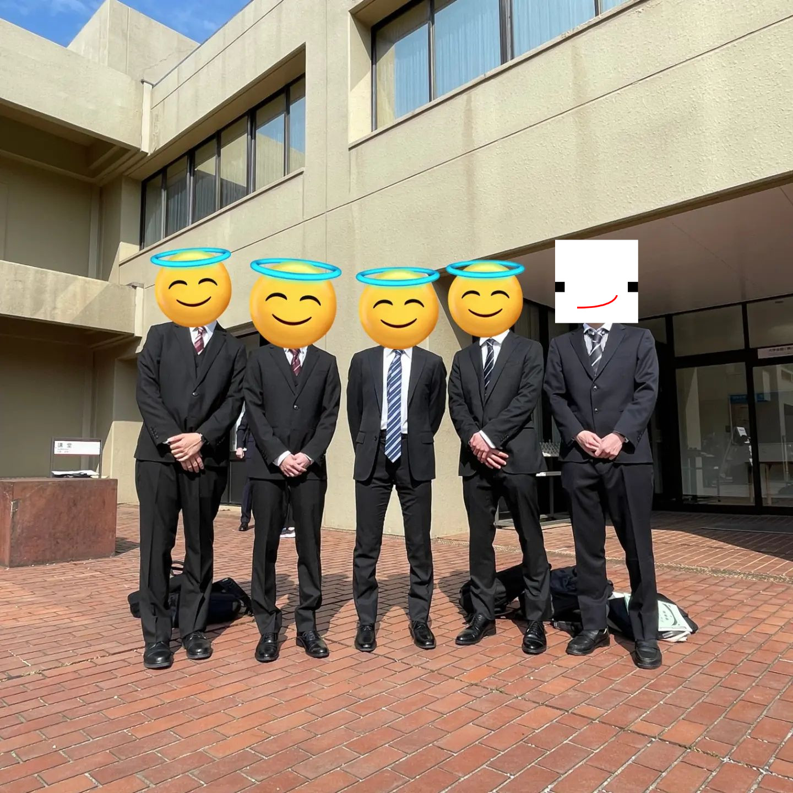
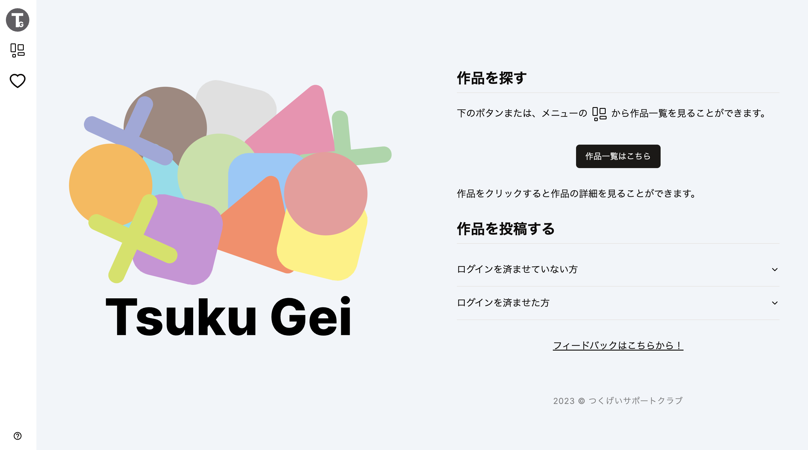

import { TwitterTweetEmbed } from 'react-twitter-embed';

こちらは[**klis（筑波大学情報学群知識情報・図書館学類） Advent Calendar 2023**](https://adventar.org/calendars/8957)と[長野高専 Advent Calendar 2023](https://qiita.com/advent-calendar/2023/nnct) 23 日目の記事です！  
本当は[長野高専 Advent Calendar 2023](https://qiita.com/advent-calendar/2023/nnct)にて別記事を各予定でしたが、間に合わなそうだったので急遽こちらの記事にリンクしました🙇🙇

:::warning
ポエム注意
:::

{/* truncate */}

## 誰？
今年から筑波大学に編入してきた、元長野高専生のklis3年です！詳しくは[bonychops.com](https://bonychops.com)を見てください。

## 宣伝

今年はかなり多めにアドカレを書いています！よかったらそちらも見てください！

| 日付  | タイトル                                                                                                                                                                  | カレンダー                                                               | サイト       |
| ----- | ------------------------------------------------------------------------------------------------------------------------------------------------------------------------- | ----------------------------------------------------------------- | ------------ |
| 12/4  | [**制約で固められた環境をできるだけモダンに踏み倒す**](https://qiita.com/BonyChops/items/8488d39694847a2ed681)                                                            | klis（筑波大学情報学群知識情報・図書館学類） Advent Calendar 2023 | Qiita        |
| 12/4  | [**GitHub Actions をどこでも！self-hosted runners がアツかった**](https://qiita.com/BonyChops/items/a617e0f6129056de98f7)                                                 | 長野高専 Advent Calendar 2023                                     | Qiita        |
| 12/12 | [**インターン生がプロジェクトの GitHub Actions を AWS CodePipeline に移行した話**](https://medium.com/mixi-developers/transfer-from-actions-to-codepipeline-c71932fdab53) | MIXI DEVELOPERS Advent Calendar 2023                              | Medium       |
| 12/17 | [**月曜日をもっと楽しく迎える bot**](https://qiita.com/BonyChops/items/e0a8fefc4422167fb5b9)                                                                              | 長野高専 Advent Calendar 2023                                     | Qiita        |
| ~~12/23~~ | ~~**Shorts 系 AI 弁護士作ってみた**~~                                                                                                    | ~~長野高専 Advent Calendar 2023~~                                     | ~~Qiita~~        |
| 12/23 | **2023 年を振り返って** (本記事)                                                                                                                                          | klis（筑波大学情報学群知識情報・図書館学類） Advent Calendar 2023 | blog.b7s.dev |

CI/CD 関連の話が多いですね(あとポエム)。

## はじめに

まずは皆様、**2023 年もお疲れ様でした**。皆様にとって 2023 年はどんな年だったでしょうか。世界情勢的な視点でいうと、2023 年はコロナがやっと落ち着いてきて、経済活動が再開しつつある年だったと思います。自分としては、本年度に筑波大学へ編入し新しい環境でスタートの年だったので、従来までとは行かないと思いますが、かなり羽を伸ばせた年なんじゃないかなと思います。

## 時系列

すべてを一気に思い出すのは難しいので、まずは時系列で振り返って行こうと思います。当時の X(Twitter)や GitHub、写真などを見返して色々思い出しながら書きますが、もしかしたら取りこぼしがあるかもしれないです。

### 1 月 - 3 月

今年の 3 月まではまだ長野高専に在籍していたので、それ関連の内容が多めです。  
この頃は5年間ともにした仲間と最後の思い出を残したり...といいたいところですが、実際は卒研やレポート(verilogなど)に追われていました...  
制作物でいうと、この頃は最後のTwitter Botを作って遊んでいました。というのも、TwitterがXに変わってからAPIに大きめの制約が加わり、個人ではとてもじゃないけど払えない額をX社に収めるか、ほぼ何もできないぐらいガチガチの制約の上で遊ぶかの二択に強いられ、自分は諦めました。

<TwitterTweetEmbed
    tweetId={'1621043873706565633'}
/>

この頃作ったbotで言えば、TLspachaやTLImpactが挙げられます。

<TwitterTweetEmbed
    tweetId={'1611173194370781185'}
/>

また、自分はちょうど ChatGPT を使い始めたのもこの頃みたいです。今でこそほぼ当たり前になったChatGPTが流行り始めたのもここ1年と考えると、技術革新の速さというのにはいつも驚かされます。ちょっと前まで"AIは若干古い"みたいな風潮があったと思います(要出典)が、今ではWeb3のことなんて誰も覚えていません...

また、これは厳密に言うと昨年の11-12月の出来事なのですが、ちょうどHack U KOSEN 2022で最優秀賞を受賞した頃です(賞を受け取ったのは1月)。メンバーも自分も、まさか優勝できると思っていなかったので本当に驚きました。とは言え、あの期間自分もメンバーも本当に頑張っていて、それが審査員の方にも工夫点として伝わったことが、本当に嬉しかったです。高専卒業前の最後の思い出として残せてよかったなーと思います。

<TwitterTweetEmbed
    tweetId={'1612655852594561024'}
/>

1-3月は、そんな高専卒業とそれにまつわるエピソードが大半の時期でした。

<TwitterTweetEmbed
    tweetId={'1623875449792389120'}
/>

### 4 月 - 5月

4月、言わずもがな筑波大学編入の月ですね。学期の始まりということもあり、多くのものが自分にとって新しく、また、新しくなった月でした。

<TwitterTweetEmbed
    tweetId={'1643543972718186498'}
/>

結局編入体験記書きませんでしたね^^; 自分はかなり技術に寄っているタイプの形で編入しましたので、そういった他の方にとって自分の情報は少なからず有益だと思うのですが、結局重い腰が上がりきらず... 今度こそはどこかで書きたいですね（書くのか？）

こんなこと言ったらすでにつくばにお住まいの人に笑われちゃうと思うんですが、長野出身の自分にとって関東に移住するっていう時点で気分は上京でした。つくばエクスプレスのおかげで最短45分で秋葉原に行けるなんで、実質東京と言っても過言ではないですね。そんなつくばエクスプレスが、自分はとても好きです。3000系に乗車できたときはちょっとテンションが上がります。

編入した自分は、大奮発してmacデビューしました... *my new gear...*  
正確に言うと、奮発というより覚悟ですね。新生活ということもあり、親に懇願すればおそらく買ってもらえないこともなかったと思いますが、自分が今後しばらく肌見放さず使うものを人から買ってもらうのもな、と思い、 **漢の24回分割払い** でローンを組み、今も返済しながら愛用しています^^;  
ですが、今となってはあそこででかい覚悟を決めてよかったと思っています。というのも、ここで巻いた種(このmacを含む)はこの一年で大きく成長するためのきっかけとなったことは揺るがない事実だからです。自分はmacを買ったおかげで実質的に作業場所という制約がなくなり、生産性がありえないぐらい向上しました。

<TwitterTweetEmbed
    tweetId={'1648939326418587648'}
/>

また、入学してすぐ始めたことは **インターン探し** でした。大学来ていきなり！？！？という感じだと思いますが、自分はエンジニアとして働くことにとても関心があったといいますが、様々なきっかけもあり、早く就業体験をしたいな！という気持ちがありました(もちろん大学に来ることもとても楽しみでしたよ！)。  
後に述べるインターンはすべて[サポーターズ](https://talent.supporterz.jp/)というサイトの1on1イベントで出会った企業様からオファーを頂き受けさせていただいたものです。自分はわがままなので、有給でオンラインのインターンのみを探していたのですが、それでもマッチできたことが本当に奇跡です。ステマだと思われたくないので書きますが、電話でのイベント勧誘が少し多いこと[^1]以外は本当に素晴らしいサイトですので、インターンを探している方はぜひ活用してみてください。

筑波大学に来てから最初に編入生へ立ちはだかる壁は**単位認定**です。特に筑波大学は他学類の授業を取れる都合上、取れる可能性のある単位が膨大にあり、その中から自分の持ち合わせている単位と照らし合わせて合計単位数の最大値を求める、いわゆる**単位パズル**を強いられます。klisは昨年8月という早い段階から面談があるのですが、その場で自分が仮提出した単位変換計画だと**50単位**であり、「流石に少なすぎ^^;」と言われてしまいました。  
4月での単位変換は、認定使うシラバスをかき集める必要があったんで、下記のツールを作りました。新年度も使えるはずなので、もし高専から編入する予定がある人はぜひ使ってください。    

[高専シラバス一括ダウンロードツールを作った](/2023/03/30/fetch-kosen-syllabus)  
自分は最終的に69単位でした(70が上限)。

筑波大学には、特徴的な授業として[enPiT](https://enpit.coins.tsukuba.ac.jp/about/)や[COJT](http://www.cojt.or.jp/tkb/outline/index.html)があります。どちらも実践型な授業で、通年で開講している共通点があり、特徴としてenPiTはプロダクトの実現に重きを置いている、COJTは技術習得に特化しているといったところでしょうか。自分はenPiTを取りました。春学期夏休み前のenPiTは基本的に自主学習期間と呼ばれ、夏休み中の集中講義に向けた自主学習をする時間が設けられています。自分はその期間にApacheやNext.jsと戯れていました(特にNext.jsはその後の実際のプロダクトに活かすことができたので触っていて本当に良かったです)。

### 6 月 - 7月
この頃から、自分が履修していた[知識情報システム実習A](https://kdb.tsukuba.ac.jp/syllabi/2023/GE70113/jpn)や[知識情報演習I](https://kdb.tsukuba.ac.jp/syllabi/2023/GE11022/jpn)が実際の実装パートに入ってきます。高専に居た人はご存知かも知れませんが、自分は稀に授業課題へ異常なほど時間を投入することがあり、これらは特に力を入れた科目になります(特に制作系は好きなので力が入りがち)。  
その結果、[知識情報演習I](https://kdb.tsukuba.ac.jp/syllabi/2023/GE11022/jpn)では賞をいただくことができました！([知識情報システム実習A](https://kdb.tsukuba.ac.jp/syllabi/2023/GE70113/jpn)や[知識情報演習I](https://kdb.tsukuba.ac.jp/syllabi/2023/GE11022/jpn)は何もいただけなかった...:sob:)

<TwitterTweetEmbed
    tweetId={'1684156442826395648'}
/>

Goに興味を持ち始めたのもこの頃です。4月に受けたサポーターズの面談にてお話させていただいた企業様と話したとき、Go言語でのサーバーサイド構築事例の多さや、単純に昨年から興味があったということもあり、ここらへんで本格的に勉強するかーと思い触ってみたところ、CやJavaをかじったことがある自分にとってはすっかり好きになってしまいました。

<TwitterTweetEmbed
    tweetId={'1667440255589564416'}
/>

7月からは株式会社ピクシブでのインターンが始まります。この規模のユーザーを抱える大規模なサービスを抱える企業さまでのインターンはこれが初めてです！

(↓**P**ixivになっている...)
<TwitterTweetEmbed
    tweetId={'1678214957748613121'}
/>

7月の最後にはenPiTの集中講義がありました。芸術専門学群(芸専)の方々の作品をもっといろんな方に知ってほしい！という目的の元[^2]集まったメンバーで、芸専向けポートフォリオサイトを作ることになったのですが、メンバーが

- 某企業でのCTOを務める元東京高専生
- 元は芸術関連を専攻する予定だった情報学履修中のデザインプロ
- 芸専の知り合いが何人かいる人脈のプロ

みたいなチーム編成だったので負けるはずがありませんでした[^3]。春学期、諸事情により前半はオンラインでしか参加できませんでしたが、後半は持ち前の声量の大きさだけで実装を乗り切りました。多分一番盛り上がった班だと思いますw めちゃめちゃ楽しかった。  
出来上がったプロダクトは、Next.jsで実装したポートフォリオサイトです。芸専向けということもあり、デザインには最新の注意を払う必要がありましたが、その点プロがうちの班にはいたので、みるみるうちにきれいなUIが完成していくのを目の当たりにした自分は呆気にとられしまいました...

<TwitterTweetEmbed
    tweetId={'1684156208050237441'}
/>

### 8 月 - 9月
夏休みは基本的にpixivでのインターンをバリバリやってましたね〜内容を多くは言えないのですが、PHPやTSでバリバリやってました(詳しくは10-11月で)。

また、8月にナレッジワークの2Wインターンに参加しました！  
ナレッジワークでのインターンでは、Goを用いた実際のプロダクトの認証部分の構築を行いました。X(Twitter)で著名な、エンジニアとしてもかなりレベルが高い方々に直接教えてもらいながら行った2Wのインターンはとても有意義でした。また、このインターンはグループワーク方式だったのですが、一緒に参加した院生の方々もかなりレベルが高かったです。

<TwitterTweetEmbed
    tweetId={'1693427699895898144'}
/>

8, 9月での技術的な内容は以上になります😅😅😅😅😅  
というのも、この時期はほぼインターンをしていたということもあり、あまり細かいことがかけません...

技術以外の話で言えば、この時期に三重旅行へ行きました。

自分はジャパニーズパワーソウルフードのakafukuが大好物なのですが、本場三重の赤福本店で食べた赤福は最高でした。  
ちょっと贅沢して本場で松阪牛も頂きました。普通に贅沢するつもりで言ったのでうん万円を覚悟していたのですが、[松阪牛肉亭 長太屋](http://www.chodaya.jp/)はすごくリーズナブルで美味しかったです。もし三重に行く予定がある人はぜひ。

### 10 月 - 11月
ピクシブ株式会社でのインターンが終わりました！

<TwitterTweetEmbed
    tweetId={'1710239418232324552'}
/>

前述した通り、ここまでのユーザーを抱えるサービスのインターンは初めてだったので、ここでのインターンは本当に良い経験になりました。3ヶ月のインターンでしたが、本当にあっという間で、自分が携わる部分の全容が見えてきて、まだまだこれからというところで終わってしまいました...

12/24加筆😅

### 12月
12/24執筆😅

## さいごに
全体を通して見ると、インターンが多い年でしたね。4月に筑波大学へ編入してから、間髪入れずにインターン探しを始めたのが良かったのかなあと思います。  
もちろんサークルや団体を探して入るのでも良かったのですが、自分は自分で自分の使い方を決めたほうが充実するのかなと思い、結局今も一人で色々やっています。  
ただ、今年は初めて会う人が多く、沢山の人にいろんな局面で助けられたことが多いと感じた年でした。一人で活動していると言っても、部分部分で色んな方々の支えがあってこと成し遂げられたものがたくさんあるなと感じます。皆様いつも本当にありがとうございます。来年はもっと羽を伸ばして、いろんなことに挑戦したいと思いました！  
それでは皆様、よいクリスマス/クリスマスイブ/ホリデーをお過ごしください。

[^1]: 就活支援サイトはどこもこんな感じらしいので、サポーターズが必ずしも悪いわけではないです
[^2]: そういう自分は芸専の定義すらよく知らない状態で入りました... 😅😅😅😅😅
[^3]: 実際勝ち負けとかはないです