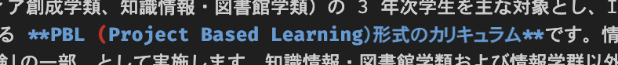
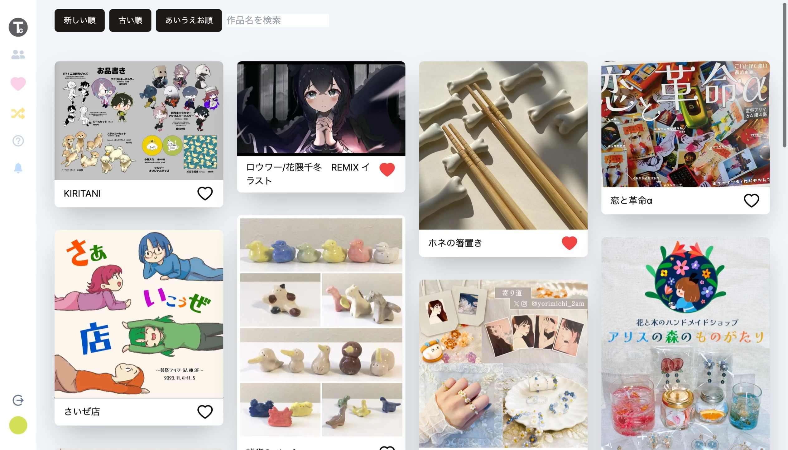

本記事では、本年度(2023 年度)に自分が受講した enPiT カリキュラムの体験談になります。最終レポートがブログ形式だったので、こちらで公開させていただきます。

:::caution 来年度から受講される皆さまへ
本記事で掲載している内容は 2023 年度の内容であり、**来年度以降は開講時期が一部変更されます**。詳細は公式ページ([enPiT の 1 年 - enPiT-BizSysD × 筑波大学](https://enpit.coins.tsukuba.ac.jp/year/))やシラバスなどを必ず確認してください。
:::

<!--truncate-->

## enPiT とは？

> 「enPiT」は情報学群（情報科学類、情報メディア創成学類、知識情報・図書館学類）の 3 年次学生を主な対象とし、ICT/IoT を活用して社会ニーズに応えるアプリケーションやシステムをチームで開発する **PBL (Project Based Learning）形式のカリキュラム**です。情報科学類では「主専攻実験」の一部、情報メディア創成学類では「情報メディア実験」の一部、として実施します。知識情報・図書館学類および情報学群以外の学生向けには情報学群共通科目「ビジネスシステムデザイン A、B」として実施します。
>
> _[enPiT について（学類生の方へ） - enPiT-BizSysD × 筑波大学](https://enpit.coins.tsukuba.ac.jp/about/)_

どうても良い余談

上記で引用した公式の紹介文、括弧が対応していない部分がありましたね w(VSCode の Syntax Highlight で気づいた)

enPiT は PBL: **実際にちゃんと手を動かす形式**の授業です。自分は知識情報・図書館学類(klis)ですのでそれ以外の学類の事情には明るくないのですが、klis が受講する場合、**[ビジネスシステムデザイン A](https://kdb.tsukuba.ac.jp/syllabi/2023/GA40303/jpn)**(春学期) or **[ビジネスシステムデザイン B](https://kdb.tsukuba.ac.jp/syllabi/2023/GA40403/jpn)**(秋学期)を受講することになります。

:::caution
ここでの **or** は **xor** ではないので、**いずれか**、または**両者**という意味です！両方とっても良いし、任意の片方だけを取ることもできます。  
ただ、自分はできるのであれば **両方を受講する** ことをおすすめします！春学期のプロジェクトを引き継ぐことが可能だったり、両者受講することでより内容の深い理解に繋がります(単位的にも美味しい...)。
:::

:::info
日程的にどうしても A xor B しか受けられないよ；；という方もご安心ください。自分も実際秋学期にインターンがあって受講が難しく断念する予定だったのですが、教員と相談して**どうにか受講することができました！**
どうやってそれが実現したかは明言できないのですが、**受けたいのにスケジュール的に受けられない！**という方は**まずは教員と相談しましょう！**
:::

具体的に授業で何を学ぶのかというと、

> **ニーズ駆動でのチームによるシステム開発技法を学びます**。  
> 身の回りの課題を取り上げて解決策を提案し、適切なシステム構成を設計、実装とレビューを繰り返して**問題を真に解決するシステム**を探索的に作り上げます。開発言語や技術は開発内容により異なります。具体的な学習の内容や特徴に関しては、「 [enPiT の 1 年](https://enpit.coins.tsukuba.ac.jp/year/) 」をご覧ください。
>
> _[enPiT について（学類生の方へ） - enPiT-BizSysD × 筑波大学](https://enpit.coins.tsukuba.ac.jp/about/)_

です。「**それ、本当に必要？**」「**なんでそれがいるの？**」を突き詰めた開発技法を学びます。具体的な開発技法としては、

> それが**アジャイル**だ  
> _―謎の自動音声[^1]_

が学べます。冒頭でも述べた通り、学類やとる授業によって様々な受講スタイルを選べます。詳しくは、[**enPiT の 1 年**](https://enpit.coins.tsukuba.ac.jp/year/)をご覧ください。自分は[**ビジネスシステムデザイン A**](https://kdb.tsukuba.ac.jp/syllabi/2023/GA40303/jpn)(春学期)と[**ビジネスシステムデザイン B**](https://kdb.tsukuba.ac.jp/syllabi/2023/GA40403/jpn)(秋学期)の 2 つを通年で受講しました。

:::info 専門用語について
以降の説明では、enPiT で用いたビジネス・専門用語について文中で解説しません。enPiT 受講予定の皆様は、Footnotes[^3]をご覧ください。
:::

## 作ったプロダクト

我々のチームでは、筑波大学の芸術専門学群に所属する学生向けのポートフォリオサイト: **Tsukugei**を開発しました。  
プロダクトの EVP[^4]は以下の通りです。

> **Tsuku Gei** は<u>作品を知ってもらう・応援してもらう機会が少ない問題を解決したい</u>。  
> 自分が作っている作品を知ってもらいたい芸専の人向けの  
> ポータルサイトです。  
> これは芸専専用のポートフォリオサイトを用意することによって、  
> SNS・メルカリとは違って  
> より自分の作品のバックグラウンドを知ってもらうことができます。

> **_人に出会うように、作品に出会える_**[^2]  
> 　*―Tsukugei*

使用した主な技術は以下の通りです。

- Next.js
- Cloud Run
- Firestore / Firebase Cloud Storage
- Tailwind CSS
- FireCMS

## チーム

- PO
  - 名の通り、プロダクトのために一番動いてた。絶望しがち。
- SM
  - 芸専の人脈のプロ。後半は完全にオタク共のタイムキーパー/仕切り役/母をやっていて大変そうだった。。
- haku
  - 同じく芸専の人脈のプロ。バグダイナソー[^7]の生みの親
- slimalized
  - Tsukugei の UI の良さをよく褒めていただけますが、ほぼ slimalized の功績と言って良いでしょう。Web デザインの依頼は[slimalized.dev](https://slimalized.dev/)まで。
- makiart
  - 技術・プロダクトの観点・諸々で全て自分を勝っているので勝ち目はありません。残念でした[^5]。
- ren
  - 秋学期から参加したにもかかわらず、音速でプロダクトと開発手法/内部事情を把握して大量の PR を生やしたエース
- 俺
  - 無限残業

### 自分の立ちふるまい

主に以下をしてました(基本的には開発が多め)

- 機能開発
- CI/CD 周りのお手入れ
- 各メンバーのフォローアップ(w/ makiart)
- レビューよろしく頼んだゾウ bot
  - 
- 微修正 PR を永遠に投げる無限残業マシン[^8]

## 軌跡

ここでは主に秋学期で行ったことを紹介します！

:::info

本当は通年の内容をたっぷり書きたかったのですが、提出期限が**本日の 23:59**だったので諦めました 😅😅😅😅😅

余力があったら今度通年の部分も書きます........
:::

### 迷走 ―そして混沌へ―

春学期の集中講義でこのテーマを掲げて以降、音速で開発を進めていましたので、ある程度プロダクトとしては持っていきたいところまでできていました(経緯は他の人のブログを見てください 😅)。具体的には

- 作品の一覧
- 作品の詳細
- ユーザーページ

が実装され、当初の EVP をある程度満たしていると言えます。

EVP(再揚)

> **Tsuku Gei** は<u>作品を知ってもらう・応援してもらう機会が少ない問題を解決したい</u>。  
> 自分が作っている作品を知ってもらいたい芸専の人向けの  
> ポータルサイトです。  
> これは芸専専用のポートフォリオサイトを用意することによって、  
> SNS・メルカリとは違って  
> より自分の作品のバックグラウンドを知ってもらうことができます。

ですが、それが仇となり、 **我々はやることを見失いました。** この授業は機能の数やページの美しさで評価が決まるものではありません。 **どのユーザーをターゲットにした、どんなプロダクトなのか** がはっきりしていなければ、プロダクトとして価値があるとは言い難いです。

迷走した我々は、各スプリントでとりあえず開発する機能を挙げていきます。

- > _？「うーーん、取り合えず**通報機能**作るかあ？」_

- > _？「ほら、作品に出逢いたいって言ってたじゃん、**T◯nder 風の UI** にすれば満たせるくね」_

- > _？「作品のバックグラウンドを示すのに詳細を書かない輩がいるなあ...せや！**GPT に勝手に書かせる機能を作ろう！**」_

毎スプリントでゴールを聞かれ答えるのが苦しい日々、我々は当初の EVP に縛られ、なかなか結論が出ない日々を過ごしました。

:::info ゴール

ここでのゴールは、スプリントで **"すること"** ではなく **"ユーザーに対してどのような価値が付加されるのか"** が重要です。

> _リファクタリングしました！_

はだめってことですね(ｷﾋﾞｼｲ...)

:::

### 耳をすませば

我々は**開発の手をいったん停めました。** そもそもこのプロダクトは **芸専向け**のプロダクト。彼らの声なしでは今後の方向性は決まりません。  
こうして我々は芸専の人から生の声を聞くために、あの手この手で声を収集しました。

ここで気付かされたのが、我々がターゲットにしている芸専の方々は enPiT で授業を受けていない人が多いため、声を聞くだけでも一苦労です。ほかチームではターゲット層が授業履修者にいるので、授業時間内で聞きに回ることができますが、我々はその時間内で終わることが難しく、基本的には時間外で聞きに行くことがほとんどでした。改めて、 **プロダクトづくりの難しさってこういうところにあるんだな...** と実感した瞬間です。

具体的に行った活動や議論:

- 芸専の教員にプロダクト゚に関する意見を求める
  - 大学オフィシャルにするよう働きがけて(例えば課題提出方法にしてしまうなど)、そうすればみんなが使うようになるのでは？
- 教務に卒展で使っていただけないか提案
  - 時間的に厳しいかなあ
- 春学期に収集した意見をまとめてみよう
  - ↓ それを元にして作った PBL[^9]
    - 

### Tsukugei v2 へ

そして最終的に出来上がったのが現在の形の Tsukugei です。大きな仕様は変わっていないので厳密には v1.90 と行ったところでしょうか？

- **トップページは作品一覧に**: YouTube のように初手から出会える
- **応援機能**: ハートでブックマークと応援を兼ねる
- **コメント機能**: 本人にのみ閲覧可能なコメントを残せる
  - レビューで一般公開でも良いのでは？という声を頂いた
- **スワイプ機能**: 本人の好みではなく、パッタリと出会える
- **もっと見るボタン廃止**: 無限スクロール
- **ロードを高速化**: 画像サイズを小さくし、データフェッチ時のアルゴリズムを改善
- などなど...

基本的には芸専やメンターの方、我々が感じた改善点などをベースに機能開発、改善を行いました。

## 得たもの

### 技法的観点

#### プロダクトしての価値は何！！

我々の一番のテーマですね。我々が開発しているプロダクト、それは誰に向けたものですか？なぜその技術を選ぶのですか？自分は技術が好きなのでエゴが入った選定をしがちですが、このような観点をちゃんと持ったプロダクト開発を学びました

#### それが Agile だ[^1]

スプリント、スクラム、ステークホルダ、アーリーアダプタ[^10]... Agile にはたくさんの気にすべき事項があります。**それが Agile だ**[^1]

#### 教育教育教育教育成長成長成長成長成長成長

これは個人的観点ですが、この授業では比較的技術のフォローアップを行う機会がたくさんありました。その中で、 **どの用に伝えるのが本人にとって理解が容易いか** ということを常に意識していました。学習というのは点と点のつながりですので、本人がすでに持っている知見といかに結びつけるような言い方ができるのかが肝なのかなと思います。

### 技術的観点

#### Next.js

今回のプロダクトで用いたのもそうですが、自分は今年度に Next.js(App Router)から履修しました。そのおかげで今はある程度使えるようになりました(基本は React がベースですしね)。

#### CI/CD

- PR 作成時に Discord でレビュワーをメンションして叩き起こす
- Cloud Run にて各 PR のコメントに Preview リンク発行
- Firestore Security Rules を GitHub Actions でテスト

など、割と良い経験をしました。ここらへんは有用だと思うので機会があればまた記事を書くかもしれません。

## 運営へのフィードバック

書いてもいいということだったので書きます！！！！！！！！

### 最高の授業でした

PBL 形式の授業がそもそも好きというのもありますが、自分はその中でも特出して楽しめた授業でした。自分は 3 年次編入で友達も少なかったのですが、みんなと仲良くなれたこともすごく嬉しく思います。

### ハイブリッド授業の課題

自分は事情会ってリモートも多かったのですが、それ故にリモートと対面の同時進行における課題を感じました。

- **ハウる**: 骨伝導を配布してくださりましたが、結局つけるのが面倒くさかったり持ってくるのを忘れるなどで、オンラインでの通話体験があんまり良くないときがありました。各チーム向けに会議室用の集音マイクなどがあるといいのかなーと思いました
- **寂しい**: 各チーム、対面チームは VC に加えてビデオをオンにしてくれると寂しさが軽減されるのかなと思います。一人ひとりがつけるのはハードル高いかもしれないので、全員が映るようにビデオをオンにしてくださると良いかも？

## さいごに

enPiT 受講者の皆様、メンターの皆様、教員の方々、本当にお疲れ様でした。そしてありがとうございました。  
特に、先生に至っては後半ワンマンでの運営は相当大変だったと思います。我々のために開講してくださりありがとうございました。  
この授業で会得した、開発技法やビジネス的観点のみならず、新しい仲間や新たな価値観を今後も大切にしていきたいと思いました。

**改めまして、enPiT 受講者の皆様、メンターの皆様、教員の方々、本当にありがとうございました！！** 機会があればどこかでまたご一緒できますと嬉しいです :smile:

:::info 余談
下記のリアクションボタンはまだ他の人に押していただいたことがありません。 :sob: GitHub アカウントがあれば誰でも押せるので、ぜひ押していってくれるとうれしいです！
:::

## おまけ

ついさっきみんなで 🍺 行ってきました。つくげいのみんなありがとう！

(もっといい写真はなかったのか...)

[^1]: enPiT 授業用 Discord サーバーのサウンドボードに収録されていた、男性の自動音声。
[^2]: このフレーズは発表当日に決まりました 😅
[^3]: これのことです
[^4]: EVP: エレベーターピッチとは、15-30s 程の短い時間で、自分のプロダクトをアピールする手法です。本カリキュラムでは、EVP のテンプレートが提供されるので、それを埋めて EVP を作ります(その都合で若干文章が変だったりします)。
[^5]: 残念でした
[^7]: 開発当初、haku の知り合いに作品のアップロードをお願いしたところ、未だに再現方法がわかっていないバグを引き起こした現象。その時の作品がダイナソーだったためこの名前。
[^8]: メンター間では、自分がこの日にこれ以上 PR を投げるか投げないかを賭け事に使っていたらしいです(要出典)
[^9]: プロダクトバックログ
[^10]: 自分はこれを一時期間違えて"コアコミッター"と呼んでいました(？？？？)
