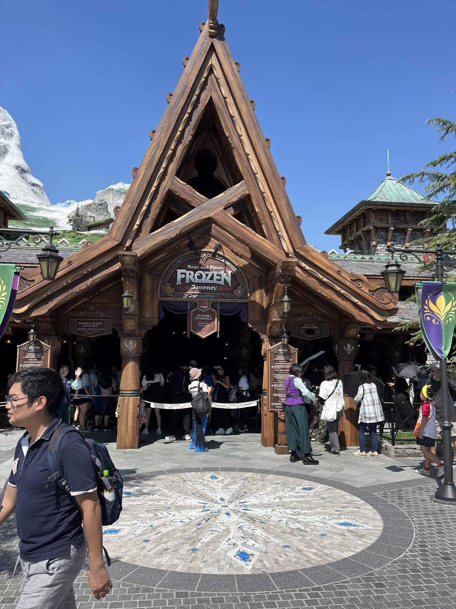
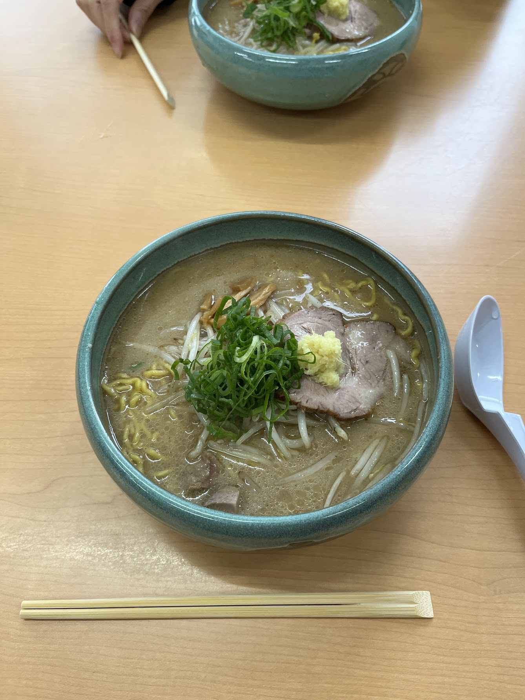

import { TwitterTweetEmbed } from "react-twitter-embed";

こちらは[**klis（筑波大学情報学群知識情報・図書館学類） Advent Calendar 2024**](https://adventar.org/calendars/10419) 22 日目の記事です！今年もこの場を借りて自分の一年を振り返ります :innocent:

:::warning
ポエム注意
:::

{/* truncate */}

## 誰？

昨年から筑波大学に編入してきた、元長野高専生の klis4年です！詳しくは[bonychops.com](https://bonychops.com)を見てください。

## 宣伝

今年のアドカレは 2 本です！

| 日付  | タイトル                                                                                                                                            | カレンダー                                                        | サイト       |
| ----- | --------------------------------------------------------------------------------------------------------------------------------------------------- | ----------------------------------------------------------------- | ------------ |
| 12/19 | [**【初参加】Web サービスを限界までチューニング、ISUCON に参加してみた - ISUCON14 参加記**](https://qiita.com/BonyChops/items/49f033744f3a78f2e2d2) | 長野高専 Advent Calendar 2024                                     | Qiita        |
| 12/23 | **2024 年を振り返って** (本記事)                                                                                                                    | klis（筑波大学情報学群知識情報・図書館学類） Advent Calendar 2024 | blog.b7s.dev |


## はじめに

まずは皆様、**2024 年もお疲れ様でした**。皆様にとって2024はどんな年でしたか？自分は...就活ばっかりしてたので語れることは少ないかもしれません :sweat: :sweat: 

## 時系列

今年は12月書く前に燃え尽きないよう、短めにまとめていきます :innocent::innocent::innocent::innocent:

### 1 月 - 3 月

#### enPiT 最終発表
enPiTの最終発表に向けて色々やってたみたいです。

<TwitterTweetEmbed
    tweetId={'1747925781588984057'}
/>

この時はFirestoreのルールをテストする仕組みを書いていました。

```typescript
const testCasesDef: TestCases = {
  Posts: [
    (db) => db.collection("posts").doc("POST_ID"),
    (params) => ({
      uid: params.uid,
      userRef: params.db.collection("users").doc(params.uid),
    }),
    {
      geisen: { read: true, write: true }, //芸専ユーザー(アクセス対象は自分のdoc)
      geisenOther: { read: true }, //芸専ユーザー(アクセス対象は他人のdoc)
      user: { read: true }, //ユーザー認証(アクセス対象は自分のdoc)
      userOther: { read: true }, //ユーザー認証(アクセス対象は他人のdoc)
      anonymous: { read: true }, //匿名認証(アクセス対象は自分のdoc)
      anonymousOther: { read: true }, //匿名認証(アクセス対象は他人のdoc)
      unauthed: { read: true }, //未認証
    },
  ],
  // ...
}
```

こんな感じに書くと、裏で読み書きに関するmocha用テストケースを生成する仕組みを作りました。

その後、enPiTが修了するのですが、これに関してはこちらをご覧ください

[enPiTを終えて](/2024/02/11/enpit-2023)

#### 個人事業主になる
実は2024の1-5月は無収入状態が続いていました :innocent: というのも、今まではインターンでがっぽり稼いでいたのですが、今年はがっぽり就活フェーズに入っていたのでインターンというわけにはいきません。仕事探すか...

通常雇用による労働は労働基準法による制約を受けます。具体的にいえば
- 深夜は割増賃金だしてね
- 休日は手当出してね
- 原則は8時間、n時間働いたらn分休ませてね
などです。自分のライフスタイル的には、これらの制約がない方がうれしいので、「せや、業務委託を受けよう」という運びになりました。
業務委託の場合、詳しくは説明しませんが「青色申告」というものをするといろいろお得になります。青色申告をするには個人事業主になる必要があります。

[Karil研究所](https://karilab.dev)  
↑なりました[^1]

この後、indeedなどでお仕事を探して引き受けて〜ということをするのですが、冷静に考えて就活の年にこれをやっているのは自分でもおかしいと思います！

#### LPIC
LPICとは、Linuxのスキルを証明するワールドワイドに認められた資格です。  
来年から働く会社([内定3](#内定3)の会社)では、募集時に「そのポジション受けるにはLPICとってね〜」ということが要項に書いてありました。

<TwitterTweetEmbed
    tweetId={'1765375692496363895'}
/>

102は落ちたと思いましたが受かることができたため、正式に選考に進めることになりました！

#### 初内定
昨年インターンを受けていた会社から内定をいただくことができました :tada:  
オフィスもすごく綺麗で、開発チームの方々もとても高いスキルを持ちつつもコミュニケーションを大事にしており、とても居心地が良い会社でした 🥲


#### 謎バズ
？

<TwitterTweetEmbed
    tweetId={'1773693884842778672'}
/>

### 4 月 - 5 月
#### それProtocol Buffersっていうんだよ

<TwitterTweetEmbed
    tweetId={'1791037010381279660'}
/>

<TwitterTweetEmbed
    tweetId={'1791037013707423789'}
/>

<TwitterTweetEmbed
    tweetId={'1791037015959749015'}
/>

要約すると、
- メッセージングプロトコルとして、両者でスキーマを把握している場合、区切り文字とか不要だよね
  - 両者でスキーマを把握している場合、nビット目はどのデータを示す、などの内容をもとにデシリアライズできるはず
- 区切り文字をなくして高効率なバイナリにしたもので通信すればパケットを減らせるのでは？

これ、卒研にも使えるやん！！と思いましたが、ちょっと調べたら、
<TwitterTweetEmbed
    tweetId={'1791039611277644181'}
/>
さすが天下のGoogle。そういうのは世の天才がすでに思いついて出回ってるんですね。

ただ、この時の気づきのおかげで、のちの業務でgRPCとProtobufを採用する際に活かすことができたのでよしとします。

#### モジュラーモノリス布教 

よく、任意のフロントエンドとバックエンドを連携する方法として、バックエンドでは表示用のAPIを開放、フロントエンドではバックエンドのAPIを叩く...のような、いわゆる結合度の低い **マイクロアーキテクチャ** を採用しがちですが、時によってはオーバーエンジニアリングを感じさせます。

実際、自分は学校課題でFlaskを指定されており、フロントエンドではReactを使いたいと思っていたため設計を考えていましたが、マイクロアーキテクチャは特にAPIの解放と連携が面倒くさすぎてやりたくないです。

いくらか調べてみたら、モジュラーモノリス設計用フレームワークであるInertiaに出逢います。こいつやあ！！！となって書いたZennがこれです。

<TwitterTweetEmbed
    tweetId={'1797961501040386554'}
/>

ただ、学校課題の要件はFlaskです。何を勘違いしたのか、記事ではDjangoでやってしまいました。 **なんで気づかなかった？？？🚬🚬🚬🚬**

ということでFlask版も書きましたよ。


<TwitterTweetEmbed
    tweetId={'1814994226163388492'}
/>


#### NAS導入

Googleアカウントのストレージ容量が15GBを逼迫し始めました。というのも、過去ではGoogle Photosが無制限だったことからはじまり、自分の写真はすべてそこにバックアップしていました。その名残で無制限が終了して以降もPhotosを使い続けた結果、ついに15GBに達したという感じです。この状態ではPhotosどころか最悪の場合Gmailも受け取れなくなります。それは結構困るので、100GBを購入しました。

100GBはそこまで高くないのですが、「このまま繰り返していったら、単純に今より支出が増えていくし、自分の資産(写真、データ)をベンダーに預けたくねえな」という気持ちが湧いてきました。過去には会社の裁量でデータを消された、消えてしまったという話を耳にします。いい機会だしNAS始めるか！と思い書いました。

<TwitterTweetEmbed
    tweetId={'1800843540098113827'}
/>

Synology DS223です。QNAPとSynologyで迷いましたが、自分の場合はそんなにゴリゴリカスタマイズしないしこれでもいいかな〜と思います。ただ、スペックの都合と暗号化機能の有無を考えると同価格帯のDS220+にすればよかったな〜〜と思います...

#### 内定2
2つ目の内定をいただきました！昔から興味がある会社だったので、内定をもらえた時はすごく嬉しかったし、ここで働いてもっと自分の技術レベルを高めるぞ〜〜 :muscle: という気持ちでいっぱいでした。
ただ、この後に登場する会社が思いがけぬ形で割り込みとして発生し、最終的にはそちらに決まります...


#### 命が吹き込まれたちいかわ
これは自分の話ではないですが、とても驚いた記憶があるので紹介します。

以下のように、LUMAで作られた動画がTLに流れてきました。

<TwitterTweetEmbed
    tweetId={'1801988898069086569'}
/>

当初これは何かのCG作品かな？と思っていました。内容を見ていくうちに「えっ！？これAIで作られた動画なの！？」と気づきました。この辺り(LUMA登場)をきっかけに、AI動画が爆発的に増えたかつ、開発や研究が活発になったと思います。


### 6 月 - 7 月

#### 応用情報技術者試験 合格
合格しました！

勉強時間は大体1ヶ月ぐらいだったと思います。

<TwitterTweetEmbed
    tweetId={'1808698258866516179'}
/>


#### 内定3
3つ目の内定をいただきました！最終的にここで確定させました。

この会社は本来行く予定がなく、記念に受けてみるか〜という気持ちで受けたのですが、内定をいただけて本当に驚きました。  
こちらも昔からとても憧れていた企業なので、内定をいただけた時はめちゃくちゃ嬉しかったです。  
正直来年度については楽しみ半分やっていけるかの不安半分という感じですが、せっかくいただいたチャンスを無駄にしないよう全力でキャッチアップとお仕事を頑張っていきたいです！

### 8 月 - 9 月

#### M3 Macbook Pro
今までM1 Macbook Air メモリ16Gを使っていたのですが、お仕事でメモリをかなり食うため限界を感じました。  
本当は2024中に出る予定だった(実際でた)M4 Proを待つ予定だったのですが、M1 Macがメモリ不足で「グギギギギ」となった時、「あもう無理だ」と感じその場でポチりました。

<TwitterTweetEmbed
    tweetId={'1830588162126840256'}
/>
かっこいい！

#### ファンタジースプリングス入れた
ディズニーシーに行った際、元々は「ビリーヴ！〜シー・オブ・ドリームズ〜」目当てで行ったためファンタジースプリングスエリアは眼中になかったのですが、キャンセル待ちでちょっと粘ったらなんと11時ぐらいの枠で入ることができました



アナ雪よかったなあ。

### 10 月 - 11 月
#### オープンラボ
自分が所属する阪口研究室では毎年学生主体でオープンラボをするのが通例です。今年もすることになったのですが、「ただやっても面白くないよな」と思い、今年は自分の発案でお昼を持参する昼食会スタイルをとってみました。

<TwitterTweetEmbed
    tweetId={'1844374728997470223'}
/>

本当はその様子を報告する記事を書こうと思っていましたが、結局燃え尽きましたw 人数は結局そんなに多くなかった(2-3人)ですが、聞きたい人にとってはフランクに様子を知れる環境を作れたのかな？と思うとやった価値はあったなと感じます。

#### 情報処理安全確保支援士試験受験、落ちた
応用受かったので次のIPA試験として情報処理安全確保支援士試験受けてみました。
応用は1ヶ月ほどの勉強でいけたので、こいつもそんぐらいでいけるだろ！と思って受けた結果、なんと午前試験で点が足りませんでした :innocent::innocent:
見る限り午後は足りていそうだったので残念...基礎的な知識が足りていない証拠なので、次回2025/4では確実に取りますよ！！！！


#### 北海道旅行
北海道初上陸！しました。




うまい飯、広大な土地、Windowsみたいな草原、全て最高でした。

ただ、初日が札幌の初雪で、そんな装備で大丈夫ではなかった自分は死にました。
現地のユニクロでダウンやらマフラーを買ってことなきを得ました...(皆さんも行く時は舐めない方がいいです)

### 12月

#### ISUCON14
ISUCONに初めて出てみました。結果やまとめは以下の記事に書いていますが、結構悔しいです！来年も絶対出るぞ。

[【初参加】Webサービスを限界までチューニング、ISUCONに参加してみた - ISUCON14 参加記](https://qiita.com/BonyChops/items/49f033744f3a78f2e2d2)

#### 納車！
公開垢では言及していませんが、納車しました！  
Honda VEZEL e:HEV Z 2024 (6AA-RV5)です！


## さいごに

全体を通して見ると、意外といろいろやってましたね。  
ただ、ここには書いていないですが裏で就活関連のことを悶々とやっていた時間も結構長いです。その中でも色々挑戦できた方かなとは思います。

人として広い視野を持つためには色々挑戦するしか方法はないんだなあと感じます。来年からは社会人になるため、生活がどのように変わるかは正直まだ完全にはイメージできていませんが、来年度以降もさまざまなことに挑戦したいですね。まあ、一番は4月までにたくさんあがくことですかねw

それでは皆様、よいクリスマス/クリスマスイブ/ホリデーをお過ごしください。

[^1]: サイト自体は2024/12に作りました