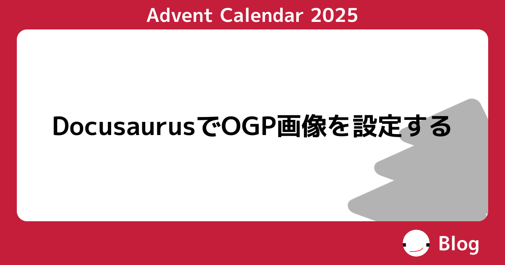

import Tabs from '@theme/Tabs';
import TabItem from '@theme/TabItem';

Docusaurus で Blog を書くのは最高です 😁 (そうなの？という方は -> [ブログをソース管理しよう！【Docusaurus 編】](/lets-docusaurus))。
ただ、標準では OGP 画像を生成する方法がありません[^static]。
本記事では、タイトルや内容に合わせて OGP 画像を生成し設定する方法を記載します。

ちなみに、この記事はこんな感じに設定されています。




{/* truncate */}

## 導入[^docusaurus-og]

基本的には [Docusaurus OG の`README.md`](https://github.com/acid-info/logos-docusaurus-plugins/tree/main/packages/docusaurus-og)に書いてあることをすれば良さそうです。

### プラグインの導入

1. プラグインのインストール
   ```sh
   npm install @acid-info/docusaurus-og
   ```
2. `docusaurus.config.js`の設定
   ```js title="docusaurus.config.js"
   // ...
   // pluginsに追加する
   plugins: [
     [
       "@acid-info/docusaurus-og",
       {
         path: "./preview-images", // buildディレクトリ内でOGP画像を吐き出す先
         imageRenderers: {}, // ここは後ほど
       },
     ],
   ];
   ```
3. `satori`, `sharp`のバージョンをあげておく

   `@acid-info/docusaurus-og` で使用されている`satori`, `sharp`が古かったため、`package-lock.json`をいじって無理やりあげておきます。もっと良い方法があるかも。

   :::info
   これをしないと Font Awesome のアイコンをうまく出せませんでした
   :::

   ```json title="package-lock.json"
    "node_modules/@acid-info/docusaurus-og": {
      "version": "1.0.3-beta.2",
      // ...
      "dependencies": {
        // ...
        // highlight-start
        "satori": "^0.18.1",
        "sharp": "^0.34.1"
        // highlight-end
      },
      // ...
    },
   ```

### Image Renderer を作る

画像の生成をするコンポーネントを作ります。

:::info
ここでは blog の前提で作っているので、docs 向けの設定が知りたい場合は[公式ドキュメント](https://github.com/acid-info/logos-docusaurus-plugins/tree/main/packages/docusaurus-og#create-an-image-renderer)を参考にするか、[`DocsPageData` の型定義](https://github.com/acid-info/logos-docusaurus-plugins/blob/main/packages/docusaurus-og/src/server/types/docs.types.ts)を参照してください。
:::

:::info
TS と jsx を使っている前提の説明になっています。それ以外の設定は[公式ドキュメント](https://github.com/acid-info/logos-docusaurus-plugins/tree/main/packages/docusaurus-og#create-an-image-renderer)を参考にしてください。
:::

1. Image Renderer コンポーネントの作成

   ```tsx title="src/components/ImageRenderer/index.tsx"
   import { readFileSync } from "node:fs";
   import { join } from "node:path";
   import type {
     BlogPageData,
     ImageRenderer,
     PageData,
   } from "@acid-info/docusaurus-og";
   import React from "react";

   export const blog: ImageRenderer<BlogPageData> = (data) => {
     if (data.pageType !== "post") {
       // 記事一覧画面など
       return [
         <div style={{ display: "flex", background: "black", color: "white" }}>
           {data.plugin.blogTitle}
         </div>,
         {
           width: 1200,
           height: 630,
           fonts: [
             {
               name: "Noto Sans JP",
               data: readFileSync(
                 join(__dirname, "../../../static/fonts/MPLUS1p-Bold.ttf")
               ),
               weight: 400,
               style: "normal",
             },
           ],
         },
       ];
     }

     // 記事のページ
     return [
       <div style={{ display: "flex", background: "black", color: "white" }}>
         {data.data.metadata.title}
       </div>,
       {
         width: 1200,
         height: 630,
         fonts: [
           {
             name: "Noto Sans JP",
             data: readFileSync(
               join(__dirname, "../../../static/fonts/MPLUS1p-Bold.ttf")
             ),
             weight: 400,
             style: "normal",
           },
         ],
       },
     ];
   };
   ```

2. トランスコンパイルの設定
   :::warning
   jsx を使う場合は下記の設定がないと動作しません。TS を使用していない場合は[Vite](https://vite.dev/)や[SWC](https://swc.rs/)を用いて、上記コンポーネントが`lib`に出力されるように設定してください。
   :::

   ```json title="tsconfig.client.json"
   {
     "compilerOptions": {
       "noEmit": false,
       "composite": true,
       "incremental": true,
       "esModuleInterop": true,
       "tsBuildInfoFile": "./lib/.tsbuildinfo-client",
       "rootDir": "src",
       "outDir": "lib",
       "module": "CommonJS",
       "target": "esnext",
       "jsx": "react",
       "types": ["node"],
       "baseUrl": "./",
       "lib": ["DOM"]
     },
     "include": ["src"]
   }
   ```

3. `prestart`, `prebuild` の追加

   ```json title="package.json"
   {
     "scripts": {
       // ...
       //highlight-start
       "prestart": "tsc --project tsconfig.client.json",
       "prebuild": "tsc --project tsconfig.client.json"
       // highlight-end
     }
   }
   ```

4. `.gitignore` に `lib` を足す

   ```txt title=".gitignore"
   # ...

   # highlight-next-line
   lib
   ```

5. `imageRenderers` 設定

   ```js title="docusaurus.config.js"
   plugins: [
     [
       "@acid-info/docusaurus-og",
       {
         path: "./preview-images", // relative to the build directory
         imageRenderers: {
           // src/components/ImageRenderer/index.tsx の blogコンポーネントの場合の例
           "docusaurus-plugin-content-blog":
             require("./lib/components/ImageRenderer").blog,
           // ブログ以外はdocusaurus-plugin-content-docs, -pages で各自設定できる
         },
       },
     ],
   ];
   ```
6. フォントの導入
   
   ビルドに使用するフォントは Image Rendererに設定したパスに配置してください(ここでは`static/fonts/MPLUS1p-Bold.ttf`)。

   :::warning
   フォントのライセンスには気をつけてください。必要出れば、prestart, prebuildで実行されるフォントダウンロードスクリプト等を設定してリポジトリに同封されないようにする工夫が必要かもしれません。
   
   自分は[使用フォントのライセンス](https://fonts.google.com/specimen/M+PLUS+1p/license)をそのまま`licenses/OFL.txt`に配置しました。
   :::
7. 完成


:::note このページで試してみるとこんな感じになる

:::

### ページごとにデザインを変えたい

自分はアドベントカレンダー文化が好きなので、アドベントカレンダー記事にだけ特別なデザインを施したいです。そういう場合は `frontMatter` で独自のパラメータを使った条件分岐をさせます。

```tsx title="src/components/ImageRenderer/index.tsx"
export const blog: ImageRenderer<BlogPageData> = (data) => {
  if (data.pageType !== "post") {
    return [
      /* */
    ];
  }

  // highlight-start
  const { title, frontMatter } = data.data.metadata;
  const { advent: _advent } = frontMatter;

  const advent =
    typeof _advent === "string"
      ? _advent
      : typeof _advent === "number"
      ? _advent.toString()
      : undefined;
  // highlight-end

  if (advent) {
    return <Advent />;
  } else {
    return <Default />;
  }
};
```

```markdown title="blog/current/2025-12-01-docusaurus-ogp/index.mdx"
---
title: DocusaurusでOGP画像を設定する
authors: [bonychops]
tags: ["アドベントカレンダー", "Advent Calendar 2025", "Docusaurus", "OGP"]
# highlight-next-line
advent: 2025 # この指定の有無でデザインが切り替わる
---

...
```

## 終わりに

こんな感じになりました。具体的な実装は[ソース](https://github.com/BonyChops/blog/tree/main/src/components/ImageRenderer)を見てください。

<Tabs>
  <TabItem value="normal" label="通常" default>
    
  </TabItem>
  <TabItem value="advent" label="アドベントカレンダー">
    
  </TabItem>
</Tabs>

なかなかいい感じ。

[^static]: 静的な画像を設定する場合は`<head>`タグ内に追記するだけでできます: https://docusaurus.io/docs/seo#single-page-metadata
[^docusaurus-og]: [logos-docusaurus-plugins/packages/docusaurus-og at main · acid-info/logos-docusaurus-plugins](https://github.com/acid-info/logos-docusaurus-plugins/tree/main/packages/docusaurus-og)
