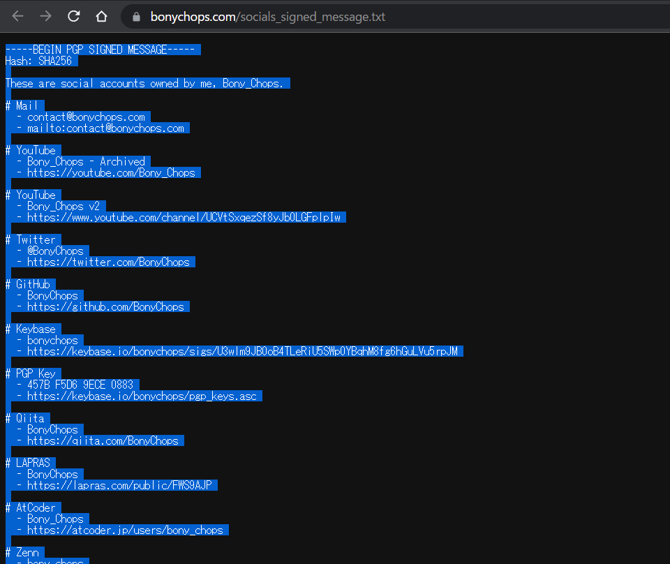
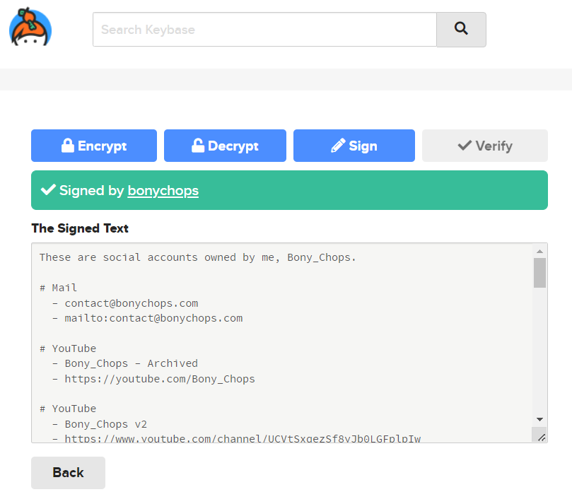

PGPによる署名を行う機会が増えたので、それの簡単な検証方法を載せておきます。細かい手順は調べたほうがわかりやすいかもしれません。
<!--truncate-->

# keybase.ioを使う
ブラウザで署名を入力するだけで使えます。ただ、何を思ったか、PGPは検証できますが**KEYBASE SALTPACKはなぜかできません**(？？？？？？)。  
KEYBASE SALTPACKはKeybaseクライアントを使いましょう(反対に、PGPはクライアント側でできないので、ブラウザでやりましょう)。  
やり方は簡単  

1. 検証したい署名メッセージをすべて選択し、コピー
1. [https://keybase.io/verify](https://keybase.io/verify)にアクセス
1. 貼り付けてVerify
1. 想定するユーザーが出れば成功です

# GPGコマンドラインツールを使う
こちらは自分で公開鍵を持ってきたり、バイナリ(画像とか)に対して検証を行いたいときに使います。書きかけ
```sh
echo "test" | gpg --clear-sign | gpg --verify
```